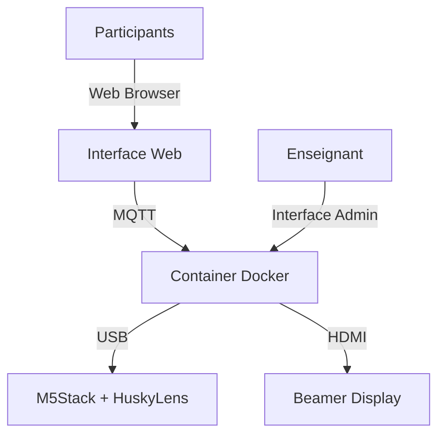

# Cahier des Charges - M5Stack HuskyLens V2.0

## 1. Vue d'ensemble

### 1.1 Objectif
Développer une plateforme éducative gamifiée permettant à 30 participants simultanés de résoudre des missions de programmation en utilisant le langage Quorum pour contrôler un M5Stack équipé d'un HuskyLens.

### 1.2 Architecture Globale


### 1.3 Composants Matériels
1. Borne WiFi avec DHCP
2. M5Stack Core S3
3. HuskyLens
4. Ordinateur portable enseignant
5. Projecteur (beamer)
6. 30 postes participants

## 2. Spécifications Techniques

### 2.1 Container Docker
#### Configuration
- Base de données intégrée
- Serveur MQTT
- Node-RED
- Serveur Web
- Système de fichiers persistant

#### Structure des fichiers
```
docker-home/M5stackHuskyLens/
├── docker-compose.yml
├── data/
│   ├── mqtt/
│   ├── nodered/
│   ├── db/
│   └── www/
├── logs/
└── config/
```

### 2.2 Interface Web
#### Interface Participant
- IDE Quorum intégré au navigateur
- Compatible mobile/tablette
- Éditeur de code avec coloration syntaxique
- Système de soumission de code
- Visualisation des résultats

#### Interface Admin (Enseignant)
- Tableau de bord de gestion
- Configuration des paramètres
- Monitoring en temps réel
- Gestion des missions
- Contrôle de l'affichage

#### Interface Publique (Beamer)
- Panneaux d'information configurables
- Classement en temps réel
- État des missions
- Statistiques
- Animations pour les réussites

### 2.3 Système MQTT
- Communication bidirectionnelle
- Bibliothèque Quorum pour MQTT
- Gestion des files d'attente
- Validation des réponses
- Monitoring des connexions

### 2.4 Base de Données
#### Tables principales
- Utilisateurs
- Missions
- Soumissions
- Résultats
- Configurations
- Logs

#### Sauvegarde
- Persistance automatique
- Export/Import des données
- Historique des sessions

## 3. Fonctionnalités

### 3.1 Système de Points
- Attribution dynamique (30 à 1 points)
- Recalcul en temps réel
- Historique des points
- Critères additionnels possibles
- Pas de pénalités

### 3.2 Gestion des Missions
- Ordre séquentiel
- Paramètres configurables
- Temps limite ajustable
- Tentatives multiples
- Priorité dynamique

### 3.3 Sécurité
#### Authentification
- Noms d'utilisateur anonymisés
- Mots de passe prédéfinis
- Session persistante
- Notification de déconnexion

#### Gestion des Erreurs
- Récupération automatique
- Sauvegarde des données
- Notification des erreurs
- Logs détaillés

### 3.4 Aspects Pédagogiques
- Système d'aide contextuelle
- Historique des tentatives
- Mode démonstration
- Statistiques d'apprentissage
- Feedback immédiat

## 4. Interface Utilisateur

### 4.1 Workspace IDE
```
+------------------------+
|  Menu & Navigation     |
+------------------------+
|    Éditeur Quorum     |
+------------------------+
|  Console & Résultats   |
+------------------------+
|    Aide & Resources    |
+------------------------+
```

### 4.2 Dashboard Enseignant
```
+------------------------+
|  Contrôle des Missions |
+------------------------+
|  Gestion Participants  |
+------------------------+
| Configuration Display  |
+------------------------+
|  Statistiques & Logs   |
+------------------------+
```

### 4.3 Affichage Beamer
```
+------------------------+
|    Mission Active     |
+------------------------+
|     Classement       |
+------------------------+
|    Stats & Info      |
+------------------------+
```

## 5. Workflow Opérationnel

### 5.1 Cycle de Mission
1. Démarrage mission
2. Soumission code
3. File d'attente
4. Exécution
5. Validation
6. Attribution points
7. Mise à jour affichage

### 5.2 Gestion Concurrence
- File d'attente FIFO
- Priorité basée sur tentatives
- Timeout configurable
- Reset automatique

### 5.3 Sauvegarde & Recovery
- Sauvegarde continue
- Points de restauration
- Export des résultats
- Backup automatique

## 6. Extension & Maintenance

### 6.1 Ajout de Missions
- Format standardisé
- Tests automatisés
- Documentation requise
- Validation intégrée

### 6.2 Personnalisation
- Thèmes interface
- Règles de scoring
- Messages système
- Layouts affichage

### 6.3 Monitoring
- Métriques système
- Logs d'utilisation
- Alertes automatiques
- Rapports périodiques

## 7. Prérequis Techniques

### 7.1 Matériel
- CPU : 2 cores minimum
- RAM : 4GB minimum
- Disque : 20GB minimum
- Port USB disponible
- Sortie HDMI

### 7.2 Logiciel
- Docker Engine 20.10+
- Docker Compose 2.0+
- Navigateur moderne
- Drivers USB selon OS

### 7.3 Réseau
- WiFi 802.11n minimum
- DHCP configuré
- Ports requis ouverts
- Isolation réseau possible

## 8. Documentation

### 8.1 Technique
- Architecture détaillée
- API Reference
- Guide déploiement
- Troubleshooting

### 8.2 Utilisateur
- Guide participant
- Manuel enseignant
- FAQ
- Tutoriels

### 8.3 Maintenance
- Procédures backup
- Mise à jour système
- Résolution problèmes
- Contacts support