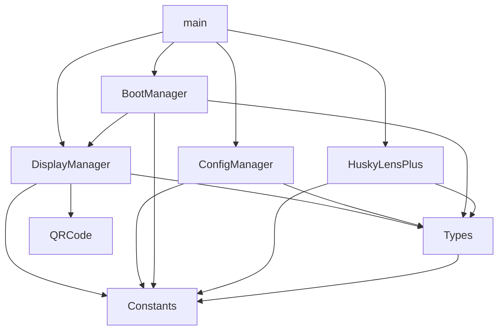

# Diagramme de dépendances

# Ordre d'inclusion
1. Constants.h (pas de dépendances)
2. Types.h (dépend de Constants)
3. QRCode.h (dépend de M5CoreS3)
4. ConfigManager.h (dépend de Types, Constants)
5. DisplayManager.h (dépend de Types, Constants, QRCode)
6. BootManager.h (dépend de Types, Constants, DisplayManager)
7. HuskyLensPlus.h (dépend de Types, Constants)
8. main.cpp (dépend de tout)