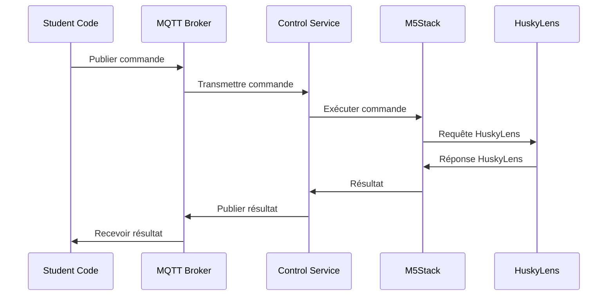

# Protocole de Communication M5Stack - V2.0

## 1. Vue d'ensemble

### 1.1 Architecture de communication


### 1.2 Flux de données
```
[Code Étudiant] -> [MQTT] -> [Service Contrôle] -> [USB] -> [M5Stack] -> [I2C] -> [HuskyLens]
```

## 2. Protocole MQTT

### 2.1 Topics principaux
```yaml
m5stack/
├── command/
│   ├── execute          # Exécution de commande
│   ├── cancel          # Annulation de commande
│   └── status          # État de la commande
├── display/
│   ├── text            # Affichage texte
│   ├── clear           # Effacer écran
│   └── image           # Afficher image
├── huskylens/
│   ├── mode            # Mode HuskyLens
│   ├── learn           # Apprentissage
│   └── data            # Données capturées
├── system/
│   ├── status          # État système
│   ├── error           # Erreurs
│   └── heartbeat       # Signal de vie
└── mission/
    ├── start           # Démarrer mission
    ├── complete        # Mission terminée
    └── validate        # Valider résultat
```

### 2.2 Format des messages
```json
{
    "messageId": "uuid-v4",
    "timestamp": "2024-12-08T12:00:00Z",
    "type": "command|response|event",
    "source": "student_id|system|m5stack",
    "payload": {
        "command": "string",
        "parameters": {},
        "timeout": "number",
        "priority": "number"
    },
    "metadata": {
        "mission": "number",
        "attempt": "number"
    }
}
```

## 3. Commandes M5Stack

### 3.1 Commandes d'affichage
```json
// Afficher texte
{
    "command": "display_text",
    "parameters": {
        "text": "Hello World",
        "x": 10,
        "y": 20,
        "size": 2,
        "color": "0xFFFFFF"
    }
}

// Effacer écran
{
    "command": "clear_display"
}

// Afficher image
{
    "command": "display_image",
    "parameters": {
        "image_id": "success_icon",
        "x": 0,
        "y": 0
    }
}
```

### 3.2 Commandes HuskyLens
```json
// Configuration mode
{
    "command": "set_mode",
    "parameters": {
        "mode": "FACE_RECOGNITION",
        "algorithm": "DEFAULT"
    }
}

// Apprentissage
{
    "command": "learn_object",
    "parameters": {
        "id": 1,
        "name": "object_1",
        "samples": 5
    }
}

// Capture données
{
    "command": "get_objects",
    "parameters": {
        "timeout": 1000,
        "filter": {
            "min_confidence": 0.8
        }
    }
}
```

## 4. Réponses et Événements

### 4.1 Format des réponses
```json
{
    "messageId": "uuid-v4",
    "correlationId": "original-message-id",
    "timestamp": "2024-12-08T12:00:01Z",
    "type": "response",
    "status": "success|error",
    "payload": {
        "result": {},
        "executionTime": "number"
    },
    "error": {
        "code": "string",
        "message": "string",
        "details": {}
    }
}
```

### 4.2 Format des événements
```json
{
    "messageId": "uuid-v4",
    "timestamp": "2024-12-08T12:00:00Z",
    "type": "event",
    "event": "object_detected|button_pressed|error",
    "payload": {
        "data": {},
        "importance": "high|medium|low"
    }
}
```

## 5. Gestion des missions

### 5.1 Démarrage mission
```json
{
    "command": "start_mission",
    "parameters": {
        "mission_id": 1,
        "timeout": 300,
        "requirements": {
            "mode": "FACE_RECOGNITION",
            "success_criteria": {
                "min_faces": 1,
                "max_faces": 3
            }
        }
    }
}
```

### 5.2 Validation mission
```json
{
    "command": "validate_mission",
    "parameters": {
        "mission_id": 1,
        "student_id": "student_123",
        "submission": {
            "code": "base64_encoded_code",
            "results": {
                "faces_detected": 2,
                "confidence_scores": [0.95, 0.92]
            }
        }
    }
}
```

## 6. Gestion des erreurs

### 6.1 Codes d'erreur
```json
{
    "error_codes": {
        "E001": "Connection error",
        "E002": "Command timeout",
        "E003": "Invalid parameters",
        "E004": "Hardware error",
        "E005": "Mission error",
        "E006": "Validation error"
    }
}
```

### 6.2 Format d'erreur détaillé
```json
{
    "messageId": "uuid-v4",
    "timestamp": "2024-12-08T12:00:00Z",
    "type": "error",
    "error": {
        "code": "E003",
        "message": "Invalid parameters provided",
        "context": {
            "command": "set_mode",
            "invalid_params": ["mode"],
            "reason": "Unsupported mode specified"
        },
        "recovery": {
            "action": "retry|abort|ignore",
            "suggestion": "Use one of: FACE_RECOGNITION, OBJECT_TRACKING"
        }
    }
}
```

## 7. Optimisations

### 7.1 Mise en cache
```yaml
cache:
  commands:
    ttl: 60  # secondes
    size: 100  # entrées
  results:
    ttl: 300  # secondes
    size: 1000  # entrées
```

### 7.2 Compression
- Utilisation de MQTT v5 avec compression
- Messages binaires pour les données HuskyLens
- Optimisation des payloads JSON

### 7.3 Rate Limiting
```yaml
limits:
  student:
    commands_per_second: 5
    data_requests_per_minute: 30
  system:
    max_queue_size: 100
    max_concurrent_executions: 10
```

## 8. Sécurité

### 8.1 Validation des messages
```json
{
    "validation": {
        "max_message_size": 4096,
        "allowed_commands": [
            "display_text",
            "clear_display",
            "set_mode",
            "get_objects"
        ],
        "restricted_commands": [
            "system_reset",
            "firmware_update"
        ]
    }
}
```

### 8.2 Sanitization
```python
def sanitize_command(command):
    # Vérification des types
    assert isinstance(command["messageId"], str)
    assert isinstance(command["timestamp"], str)
    
    # Nettoyage des entrées
    if "text" in command["parameters"]:
        command["parameters"]["text"] = clean_text(
            command["parameters"]["text"],
            max_length=100
        )
    
    # Validation des paramètres
    validate_parameters(command["parameters"])
    
    return command
```

## 9. Monitoring

### 9.1 Métriques
```yaml
metrics:
  performance:
    - command_execution_time
    - message_processing_time
    - queue_length
  reliability:
    - error_rate
    - success_rate
    - timeout_rate
  hardware:
    - m5stack_cpu_usage
    - m5stack_memory
    - connection_stability
```

### 9.2 Alertes
```yaml
alerts:
  critical:
    - connection_lost
    - hardware_error
    - system_overload
  warning:
    - high_latency
    - queue_growing
    - error_rate_increasing
```

## 10. Tests

### 10.1 Tests de communication
```python
def test_protocol():
    # Test connection
    assert connect_m5stack()
    
    # Test commande simple
    response = send_command({
        "command": "display_text",
        "parameters": {"text": "Test"}
    })
    assert response["status"] == "success"
    
    # Test timeout
    response = send_command_with_timeout({
        "command": "get_objects"
    }, timeout=100)
    assert response["status"] == "timeout"
```

### 10.2 Tests de charge
```yaml
load_tests:
  scenarios:
    - name: "Multiple students"
      users: 30
      ramp_up: 60s
      duration: 300s
      commands_per_user: 100
    
    - name: "Rapid commands"
      users: 10
      ramp_up: 10s
      duration: 60s
      commands_per_second: 10
```