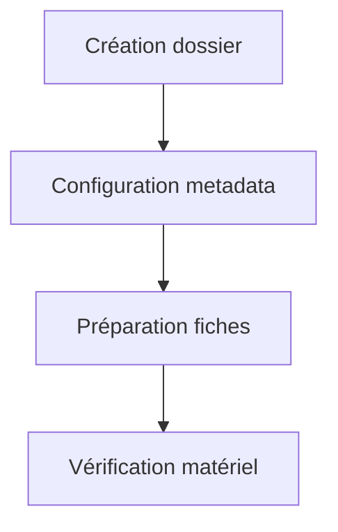
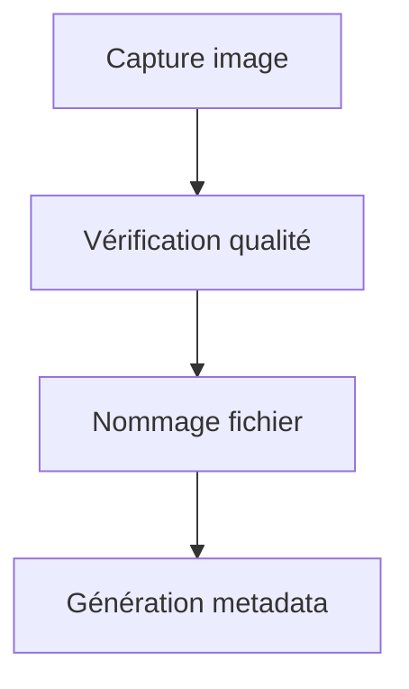
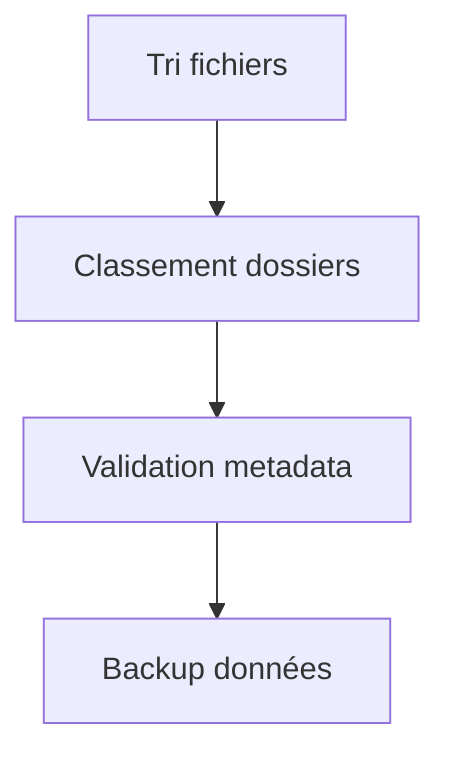

# Mission 5 : Organisation du travail

## Briefing
Pour créer un dataset efficace, une organisation rigoureuse est essentielle. Vous devez mettre en place un système de nommage cohérent et une structure de données claire.

## Objectifs d'apprentissage
- Créer un système de nommage
- Organiser les dossiers
- Définir les métadonnées
- Établir un workflow

## Système de nommage

### Convention de nommage

```
[ESPÈCE]_[DATE]_[SÉQUENCE]_[CONDITION].jpg
Exemple : MBLU_20240207_001_NAT.jpg
```

#### Codes espèces

| Code | Espèce |
|------|---------|
| MBLU | Morpho bleu |
| APOL | Apollon |
| MACH | Machaon |
| PAPI | Paon du jour |
| VULN | Vulcain |

#### Codes conditions

| Code | Signification |
|------|--------------|
| NAT | Naturel |
| STU | Studio |
| HDR | High Dynamic Range |
| MAC | Macro |

### Structure des dossiers

```
projet_papillons/
├── raw/                   # Images brutes
│   ├── MBLU/
│   ├── APOL/
│   └── .../
├── processed/             # Images traitées
│   ├── MBLU/
│   ├── APOL/
│   └── .../
├── metadata/             # Fichiers metadata
│   ├── MBLU/
│   ├── APOL/
│   └── .../
└── documentation/        # Documentation
    ├── protocols/
    ├── reports/
    └── tools/
```

## Gestion des métadonnées

### Format JSON standard

```json
{
    "image_id": "MBLU_20240207_001_NAT",
    "capture": {
        "date": "2024-02-07",
        "time": "14:30:00",
        "location": "Studio 1",
        "operator": "OP001"
    },
    "subject": {
        "species": "Morpho bleu",
        "specimen_id": "MB001",
        "size": "12cm"
    },
    "technical": {
        "device": "HuskyLens",
        "resolution": "1920x1080",
        "format": "jpg",
        "lighting": "natural",
        "distance": "30cm",
        "angle": "top"
    },
    "validation": {
        "quality_score": 85,
        "validated_by": "VAL001",
        "validation_date": "2024-02-07"
    }
}
```

## Workflow de travail

### 1. Préparation



### 2. Capture



### 3. Organisation



## Outils de gestion

### 1. Template de métadonnées

```python
def create_metadata_template():
    return {
        "image_id": "",
        "capture": {
            "date": "",
            "time": "",
            "location": "",
            "operator": ""
        },
        "subject": {
            "species": "",
            "specimen_id": "",
            "size": ""
        },
        "technical": {
            "device": "HuskyLens",
            "resolution": "",
            "format": "jpg",
            "lighting": "",
            "distance": "",
            "angle": ""
        },
        "validation": {
            "quality_score": 0,
            "validated_by": "",
            "validation_date": ""
        }
    }
```

### 2. Script de nommage

```python
def generate_filename(species, sequence, condition):
    date = datetime.now().strftime("%Y%m%d")
    return f"{species}_{date}_{sequence:03d}_{condition}.jpg"
```

## Exercices pratiques

### Exercice 1 : Création structure
1. Créez l'arborescence de dossiers
2. Mettez en place les templates
3. Testez le système de nommage
4. Validez l'organisation

### Exercice 2 : Gestion métadonnées
1. Créez des métadonnées test
2. Validez le format JSON
3. Vérifiez la cohérence
4. Testez l'exportation

### Exercice 3 : Workflow test
1. Simulez une session complète
2. Documentez chaque étape
3. Identifiez les problèmes
4. Optimisez le processus

## Points de contrôle

### Validation organisation
- [ ] Structure créée
- [ ] Nommage cohérent
- [ ] Métadonnées valides
- [ ] Workflow testé

### Questions de vérification
1. Comment gérer les versions des fichiers ?
2. Quelle procédure de backup ?
3. Comment valider les métadonnées ?

## Ressources

### Templates et scripts
- Générateur de noms
- Template metadata
- Scripts de validation
- Outils d'organisation

### Documentation
- Guide de nommage
- Standards metadata
- Procédures workflow
- Best practices

## Prochaines étapes
Après avoir établi votre organisation, vous passerez à la Mission 6 : Protocole de capture, où vous définirez les standards de prise de vue.
