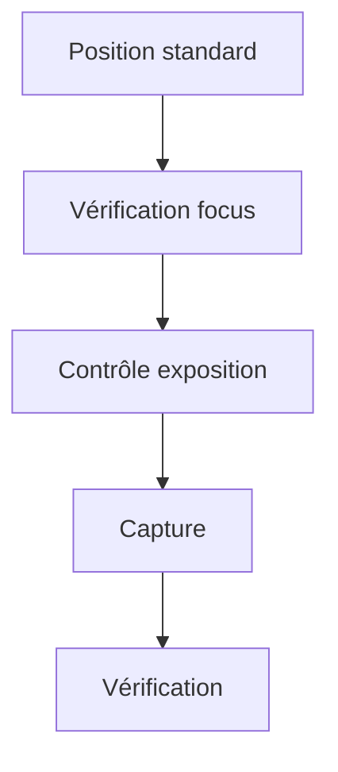
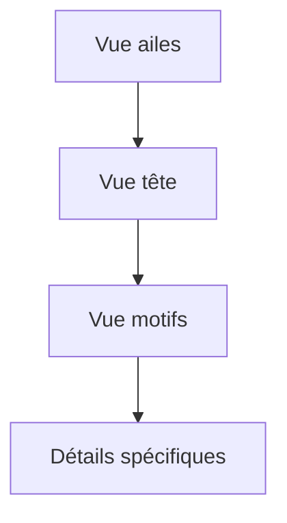

# Mission 6 : Protocole de capture

## Briefing
Un protocole de capture standardisé est crucial pour assurer la cohérence du dataset. Vous devez définir et documenter les procédures de prise de vue.

## Objectifs d'apprentissage
- Définir les standards de capture
- Établir les conditions d'éclairage
- Standardiser les angles de prise de vue
- Créer un guide de référence

## Standards de capture

### Configuration matérielle

```
Installation type
┌─────────────────┐
│    Éclairage    │
│       ↓         │
│    HuskyLens    │
│       ↓         │
│     Sujet       │
└─────────────────┘
```

### Paramètres de capture

#### Distance et angles

```
Vue de dessus
    0°
    ↑
270° ← O → 90°
    ↓
   180°

Distances standards:
- Macro: 10cm
- Standard: 30cm
- Large: 50cm
```

#### Éclairage

| Type | Intensité | Position |
|------|-----------|----------|
| Naturel | 500-1000 lux | Diffus |
| Studio | 800 lux | 45° |
| Macro | 1200 lux | Direct |

## Protocole détaillé

### 1. Préparation
1. Installation du matériel

   ```
   - Montage support
   - Réglage éclairage
   - Calibration couleurs
   ```

2. Configuration HuskyLens

   ```
   - Mode haute résolution
   - Balance des blancs auto
   - Focus mode macro
   ```

3. Vérification environnement

   ```
   - Fond neutre
   - Absence vibrations
   - Température stable
   ```

### 2. Séquence de capture

#### Vue standard



#### Vues détaillées



### 3. Points de contrôle
- [ ] Mise au point
- [ ] Exposition
- [ ] Cadrage
- [ ] Balance des blancs
- [ ] Absence de reflets
- [ ] Netteté globale

## Guide pratique

### Angles de vue standardisés

```
1. Vue dorsale (0°)
   ↑ Hauteur: 30cm
   ↑ Angle: 90° vertical

2. Vue latérale (90°/270°)
   → Distance: 30cm
   → Angle: parallèle

3. Vue oblique (45°)
   ↗ Distance: 35cm
   ↗ Angle: 45° vertical
```

### Conditions d'éclairage

```
Configuration studio
     [L1]    [L2]
        \    /
         \  /
     →  Sujet  ←
         /  \
        /    \
     [L3]    [L4]

L1-L4: Sources lumineuses
```

## Exercices pratiques

### Exercice 1 : Configuration
1. Installez le matériel
2. Réglez l'éclairage
3. Calibrez le système
4. Validez les réglages

### Exercice 2 : Prise de vue
1. Capturez séquence standard
2. Testez différents angles
3. Variez les conditions
4. Documentez les résultats

### Exercice 3 : Optimisation
1. Analysez les résultats
2. Identifiez les problèmes
3. Ajustez le protocole
4. Validez les modifications

## Contrôle qualité

### Grille de validation

| Critère | Standard | Tolérance |
|---------|----------|------------|
| Distance | 30cm | ±2cm |
| Angle | 90° | ±5° |
| Éclairage | 800 lux | ±100 lux |
| Netteté | 100% | min 90% |

### Liste de vérification

```
Pré-capture:
□ Matériel installé
□ Éclairage réglé
□ Environnement contrôlé

Pendant capture:
□ Focus vérifié
□ Exposition correcte
□ Cadrage respecté

Post-capture:
□ Qualité vérifiée
□ Metadata complétée
□ Fichiers sauvegardés
```

## Problèmes courants

### 1. Problèmes techniques
- Flou: Vérifier stabilité
- Surexposition: Ajuster lumières
- Ombres: Repositionner éclairage

### 2. Problèmes environnementaux
- Reflets: Modifier angles
- Vibrations: Renforcer support
- Température: Contrôler ambiance

## Documentation

### Journal de capture

```markdown
Date: [DATE]
Opérateur: [ID]
Spécimen: [ID]

Configuration:
- Distance: [cm]
- Angle: [degrés]
- Éclairage: [lux]

Résultats:
- Qualité: [score/100]
- Issues: [liste]
- Actions: [corrections]
```

## Ressources

### Matériel référence
- Guide éclairage
- Cartes de couleur
- Règle de mesure
- Rapporteur d'angle

### Documentation technique
- Manuel HuskyLens
- Guides d'éclairage
- Standards photo

## Prochaines étapes
Une fois le protocole maîtrisé, vous passerez à la Mission 7 : Capture test, où vous mettrez en pratique ces standards sur un échantillon réel.
