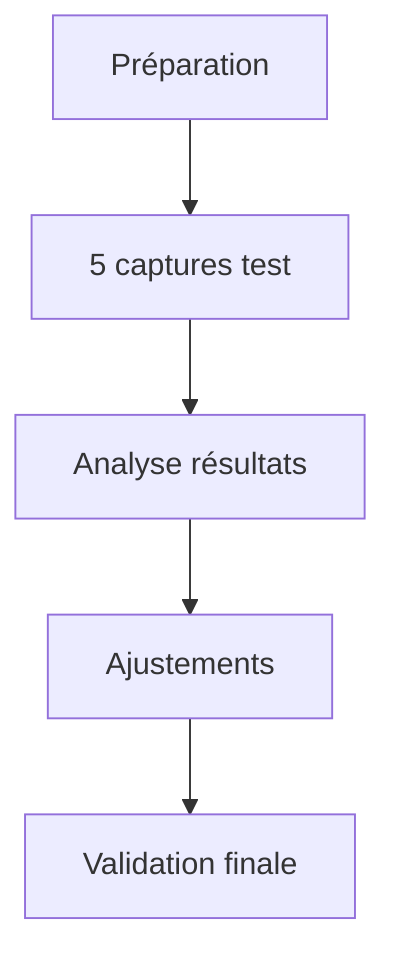

# Mission 7 : Capture test

## Briefing
Avant de commencer la collecte massive de données, vous devez valider votre protocole sur un échantillon test. Cette phase cruciale permettra d'identifier et de corriger les problèmes potentiels.

## Objectifs d'apprentissage
- Réaliser une série test
- Appliquer le protocole établi
- Évaluer les résultats
- Ajuster les paramètres

## Plan de test

### Séquence de test



### Matrice de test

| ID | Angle | Distance | Éclairage | Condition |
|----|-------|----------|-----------|-----------|
| T1 | 0°    | 30cm     | Naturel   | Standard  |
| T2 | 45°   | 30cm     | Studio    | Standard  |
| T3 | 90°   | 15cm     | Macro     | Détail    |
| T4 | 0°    | 30cm     | HDR       | Contraste |
| T5 | 45°   | 25cm     | Studio    | Texture   |

## Guide de capture test

### 1. Préparation

```
Checklist pré-capture:
□ Matériel vérifié
□ Éclairage calibré
□ Environnement contrôlé
□ Templates prêts
□ Spécimen préparé
```

### 2. Séquence de captures

```python
def test_sequence():
    captures = [
        {"id": "T1", "angle": 0, "distance": 30},
        {"id": "T2", "angle": 45, "distance": 30},
        {"id": "T3", "angle": 90, "distance": 15},
        {"id": "T4", "angle": 0, "distance": 30},
        {"id": "T5", "angle": 45, "distance": 25}
    ]
    
    results = []
    for capture in captures:
        result = perform_capture(capture)
        analyze_result(result)
        results.append(result)
    
    return results
```

### 3. Analyse des résultats

```
Pour chaque capture:
1. Vérification technique
   - Netteté
   - Exposition
   - Couleurs

2. Validation métadonnées
   - Complétude
   - Exactitude
   - Cohérence

3. Évaluation globale
   - Score qualité
   - Points amélioration
   - Ajustements nécessaires
```

## Fiche d'évaluation

### Grille de notation

```markdown
# Évaluation capture test

## Qualité technique (/50)
□ Netteté (/15)
□ Exposition (/15)
□ Couleurs (/10)
□ Cadrage (/10)

## Respect protocole (/30)
□ Angles (/10)
□ Distances (/10)
□ Éclairage (/10)

## Métadonnées (/20)
□ Complétude (/10)
□ Exactitude (/10)
```

## Journal de test

### Template de documentation

```markdown
# Journal de test - Capture [ID]

## Configuration
- Date: [DATE]
- Heure: [HEURE]
- Opérateur: [ID]

## Paramètres
- Angle: [ANGLE]°
- Distance: [DISTANCE]cm
- Éclairage: [TYPE]
- Conditions: [DETAILS]

## Résultats
- Score qualité: [0-100]
- Issues rencontrées:
  * [LISTE]
- Ajustements effectués:
  * [LISTE]

## Notes
[OBSERVATIONS]
```

## Problèmes et solutions

### 1. Problèmes techniques

```markdown
# Matrice problèmes-solutions

## Netteté
- Problème: Flou sur bords
- Cause: Distance inadaptée
- Solution: Ajuster distance +5cm

## Exposition
- Problème: Surexposition ailes
- Cause: Éclairage trop direct
- Solution: Diffuser lumière

## Cadrage
- Problème: Sujet décentré
- Cause: Guide visuel manquant
- Solution: Ajouter repères
```

### 2. Problèmes de workflow

```markdown
# Optimisations workflow

## Temps de configuration
- Problème: Setup trop long
- Solution: Créer checklist rapide

## Gestion métadonnées
- Problème: Oublis fréquents
- Solution: Template automatique

## Organisation fichiers
- Problème: Confusion nommage
- Solution: Script automatisation
```

## Outils d'analyse

### Script d'analyse automatique

```python
class TestAnalyzer:
    def __init__(self):
        self.criteria = {
            'sharpness': 0.0,
            'exposure': 0.0,
            'color': 0.0,
            'framing': 0.0
        }
    
    def analyze_image(self, image_path):
        """
        Analyse une image test
        Retourne un score global
        """
        results = {}
        # Analyse implémentation
        return results
```

## Plan d'action correctif

### Template de correction

```markdown
# Plan correctif

## Issue identifiée
- Description:
- Impact:
- Priorité:

## Solution proposée
1. Action immédiate:
2. Action moyen terme:
3. Action préventive:

## Validation
□ Test solution
□ Vérification résultat
□ Documentation mise à jour
```

## Ressources

### Documentation
- Guide analyse d'image
- Standards qualité
- Procédures correctives

### Outils
- Scripts d'analyse
- Templates rapport
- Checklist validation

## Prochaines étapes
Une fois les tests validés, vous passerez à la Mission 8 : Première série, où vous appliquerez le protocole optimisé sur un ensemble complet de spécimens.
