# Mission 8 : Première série

## Briefing
Maintenant que votre protocole est validé, vous allez réaliser votre première série complète de captures sur un ensemble de 10 images par espèce de papillon.

## Objectifs d'apprentissage
- Appliquer le protocole à l'échelle
- Gérer une série complète
- Maintenir la qualité
- Organiser les données

## Plan de capture

### Organisation des séries

```
Série 1: 50 images total
├── Morpho bleu (10)
├── Apollon (10)
├── Machaon (10)
├── Paon du jour (10)
└── Vulcain (10)
```

### Planning de capture

```mermaid
gantt
    title Planning série 1
    dateFormat HH:mm
    axisFormat %H:%M
    
    section Morpho
    Installation    :m1, 00:00, 15m
    Captures       :m2, after m1, 30m
    Vérification   :m3, after m2, 15m
    
    section Apollon
    Installation   :a1, after m3, 15m
    Captures      :a2, after a1, 30m
    Vérification  :a3, after a2, 15m
```



## Processus de capture

### 1. Préparation série

```markdown
# Checklist série

## Matériel
□ HuskyLens configuré
□ Éclairage calibré
□ Support stable
□ Batterie chargée
□ SD Card vide

## Documentation
□ Templates prêts
□ Fiches spécimens
□ Journal de bord
□ Grilles évaluation

## Environnement
□ Zone dégagée
□ Température stable
□ Lumière contrôlée
□ Absence vibrations
```

### 2. Workflow de capture

```python
class CaptureWorkflow:
    def __init__(self):
        self.session_id = generate_session_id()
        self.captures = []
        
    def start_session(self, species):
        """
        Initialise une session de capture
        """
        log_session_start(species)
        prepare_environment()
        
    def capture_sequence(self, specimen):
        """
        Réalise la séquence pour un spécimen
        """
        angles = [0, 45, 90]
        for angle in angles:
            capture = perform_capture(specimen, angle)
            validate_capture(capture)
            self.captures.append(capture)
            
    def end_session(self):
        """
        Finalise la session
        """
        validate_session(self.captures)
        generate_report()
        backup_data()
```

### 3. Contrôle qualité

```markdown
# Process qualité continu

## Pendant capture
□ Vérification immédiate
□ Ajustements rapides
□ Documentation directe

## Entre spécimens
□ Contrôle approfondi
□ Validation métadonnées
□ Backup intermédiaire

## Fin de série
□ Révision complète
□ Analyse statistique
□ Rapport détaillé
```

## Gestion des données

### Structure de stockage

```
serie_1/
├── raw/
│   ├── morpho/
│   │   ├── MBLU_001.jpg
│   │   ├── metadata/
│   │   └── ...
│   ├── apollon/
│   └── ...
├── processed/
│   ├── morpho/
│   └── ...
└── documentation/
    ├── capture_log.md
    ├── quality_report.md
    └── issues_log.md
```

### Système de suivi

```python
class SeriesTracker:
    def __init__(self):
        self.series_data = {
            'total_captures': 0,
            'species_count': {},
            'quality_scores': [],
            'issues': []
        }
    
    def track_capture(self, capture_data):
        """
        Enregistre les données de capture
        """
        self.series_data['total_captures'] += 1
        update_statistics(capture_data)
        
    def generate_report(self):
        """
        Crée un rapport de la série
        """
        return create_series_report(self.series_data)
```

## Outils de suivi

### Tableau de bord

```markdown
# Dashboard série 1

## Progression
- Total prévu: 50
- Réalisées: []
- Restantes: []
- Taux complétion: []%

## Qualité
- Score moyen: /100
- Min/Max: []
- Écart type: []

## Issues
- Critiques: []
- Majeures: []
- Mineures: []
```

### Journal de série
```markdown
# Journal série 1
Date: [DATE]
Opérateur: [ID]

## Session [X]
- Début: [HEURE]
- Fin: [HEURE]
- Spécimens: [LISTE]
- Issues: [DETAILS]
- Ajustements: [ACTIONS]

## Notes
[OBSERVATIONS]
```

## Résolution de problèmes

### Guide intervention rapide

```markdown
# Interventions

## Problème technique
1. Arrêt capture
2. Diagnostic rapide
3. Solution immédiate
4. Test validation
5. Reprise série

## Issue qualité
1. Vérification standard
2. Ajustement paramètres
3. Capture test
4. Validation changement
5. Documentation
```

## Validation finale

### Critères de réussite

```markdown
# Validation série

## Quantitatif
□ Nombre images complet
□ Tous angles réalisés
□ Métadonnées complètes

## Qualitatif
□ Score moyen > 85/100
□ Pas d'erreur critique
□ Cohérence maintenue

## Documentation
□ Journal complet
□ Rapport généré
□ Backup effectué
```

## Ressources

### Documentation
- Guide série complète
- Procédures qualité
- Templates rapport

### Outils
- Scripts tracking
- Outils analyse
- Système backup

## Prochaines étapes
Après avoir complété votre première série, vous passerez à la Mission 9 : Analyse critique, où vous évaluerez en détail les résultats obtenus.
