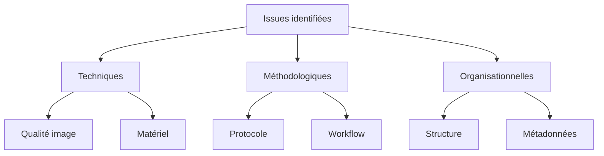
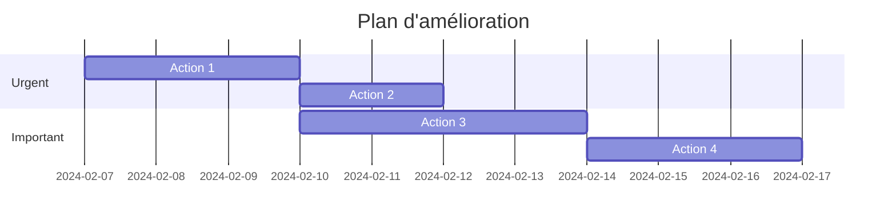

# Mission 9 : Analyse critique

## Briefing
Votre première série de captures est terminée. Il est maintenant crucial d'analyser en profondeur la qualité et la pertinence de vos données pour identifier les améliorations nécessaires.

## Objectifs d'apprentissage
- Évaluer systématiquement le dataset
- Identifier les points faibles
- Analyser les patterns récurrents
- Proposer des améliorations

## Méthodologie d'analyse

### 1. Analyse statistique

```python
class DatasetAnalyzer:
    def __init__(self, dataset_path):
        self.stats = {
            'total_images': 0,
            'per_species': {},
            'quality_scores': [],
            'metadata_completeness': {},
            'technical_issues': []
        }
    
    def analyze_dataset(self):
        """
        Analyse complète du dataset
        """
        self.count_images()
        self.evaluate_quality()
        self.check_metadata()
        self.identify_issues()
        
    def generate_report(self):
        """
        Crée un rapport d'analyse
        """
        return self.format_report()
```

### 2. Grille d'évaluation qualitative

```markdown
# Évaluation par critères

## Technique (/40)
□ Netteté (/10)
□ Exposition (/10)
□ Couleurs (/10)
□ Résolution (/10)

## Composition (/30)
□ Cadrage (/10)
□ Angles (/10)
□ Couverture (/10)

## Métadonnées (/30)
□ Complétude (/10)
□ Exactitude (/10)
□ Organisation (/10)
```

### 3. Matrice d'analyse

```
              Qualité  Quantité  Diversité
Morpho bleu   [ ]      [ ]       [ ]
Apollon       [ ]      [ ]       [ ]
Machaon       [ ]      [ ]       [ ]
Paon du jour  [ ]      [ ]       [ ]
Vulcain       [ ]      [ ]       [ ]
```

## Outils d'analyse

### 1. Script d'analyse automatique

```python
def analyze_image_set(image_folder):
    """
    Analyse un ensemble d'images
    """
    results = {
        'metadata': check_metadata_consistency(),
        'technical': evaluate_technical_quality(),
        'statistical': generate_statistics()
    }
    return results

def check_metadata_consistency():
    """
    Vérifie la cohérence des métadonnées
    """
    consistency_score = 0
    # Implémentation de la vérification
    return consistency_score

def evaluate_technical_quality():
    """
    Évalue la qualité technique
    """
    quality_metrics = {
        'sharpness': [],
        'exposure': [],
        'color_balance': []
    }
    # Implémentation de l'évaluation
    return quality_metrics
```

### 2. Tableau de bord d'analyse

```markdown
# Dashboard analytique

## Statistiques globales
- Total images: []
- Score moyen: []
- Écart type: []
- Taux de couverture: []%

## Par espèce
1. Morpho bleu
   - Images: []
   - Score: []
   - Issues: []

2. Apollon
   - Images: []
   - Score: []
   - Issues: []
   
[etc.]

## Métriques techniques
- Netteté moyenne: []
- Exposition: []
- Balance couleurs: []
```

## Analyse des problèmes

### 1. Catégorisation des issues



### 2. Matrice d'impact

| Issue | Fréquence | Impact | Priorité |
|-------|-----------|--------|----------|
| Flou  | [ ]       | [ ]    | [ ]      |
| Expo  | [ ]       | [ ]    | [ ]      |
| Meta  | [ ]       | [ ]    | [ ]      |

## Rapport d'analyse

### 1. Structure du rapport

```markdown
# Rapport d'analyse dataset

## 1. Vue d'ensemble
- Objectifs initiaux
- Résultats obtenus
- Écarts identifiés

## 2. Analyse détaillée
### 2.1 Qualité technique
- Métriques
- Tendances
- Points critiques

### 2.2 Couverture
- Par espèce
- Par angle
- Par condition

### 2.3 Métadonnées
- Complétude
- Cohérence
- Organisation

## 3. Problèmes identifiés
- Description
- Impact
- Priorité

## 4. Recommandations
- Actions immédiates
- Améliorations suggérées
- Planning proposé
```

### 2. Visualisations

```python
def create_visualizations():
    """
    Génère les visualisations pour le rapport
    """
    plots = {
        'quality_distribution': plot_quality_hist(),
        'species_coverage': plot_coverage_radar(),
        'issues_pareto': plot_issues_pareto()
    }
    return plots
```

## Plan d'amélioration

### 1. Matrice de décision

```markdown
# Matrice décisionnelle

## Priorité haute
□ Action 1
  - Impact: []
  - Effort: []
  - Deadline: []

## Priorité moyenne
□ Action 2
  - Impact: []
  - Effort: []
  - Deadline: []

## Priorité basse
□ Action 3
  - Impact: []
  - Effort: []
  - Deadline: []
```

### 2. Planning d'action



## Documentation

### 1. Template de rapport

```markdown
# Rapport d'analyse - [DATE]

## Métriques clés
- Score global: /100
- Points forts:
  * [Liste]
- Points faibles:
  * [Liste]

## Analyse détaillée
[Détails par section]

## Recommandations
[Liste des actions]
```

### 2. Journal d'analyse

```markdown
# Journal d'analyse

## Session [X]
Date: [DATE]
Analyste: [ID]

### Observations
- [Liste]

### Décisions
- [Liste]

### Suivi
- [Actions]
```

## Ressources

### Documentation
- Guide d'analyse
- Standards qualité
- Méthodes statistiques

### Outils
- Scripts d'analyse
- Templates rapport
- Outils visualisation

## Prochaines étapes
Après avoir complété l'analyse critique, vous passerez à la Mission 10 : Enrichissement, où vous améliorerez le dataset selon les recommandations identifiées.
