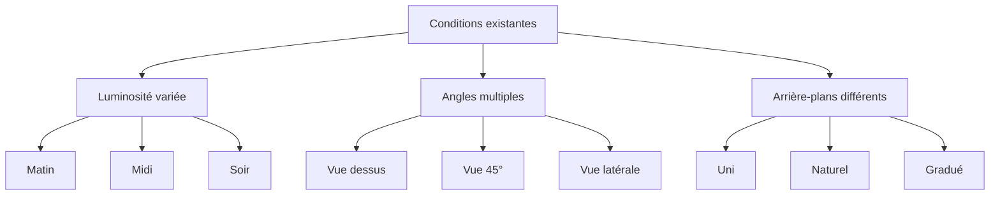
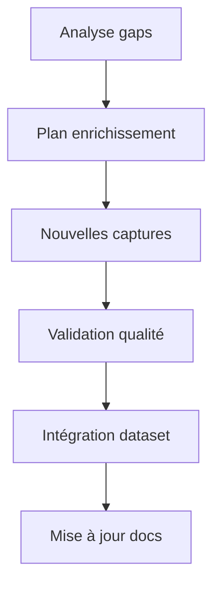

# Mission 10 : Enrichissement du dataset

## Briefing
Suite à l'analyse critique de votre dataset initial, vous devez maintenant l'enrichir pour améliorer sa qualité et sa représentativité. Le but est d'obtenir un ensemble de données plus robuste et diversifié.

## Objectifs d'apprentissage
- Diversifier les conditions de capture
- Améliorer la représentativité
- Enrichir les métadonnées
- Optimiser la qualité globale

## Plan d'enrichissement

### 1. Matrice de diversification

```
                   Naturel  Studio   Macro   HDR
Éclairage         [  ]     [  ]     [  ]    [  ]
Angle             [  ]     [  ]     [  ]    [  ]
Distance          [  ]     [  ]     [  ]    [  ]
Arrière-plan      [  ]     [  ]     [  ]    [  ]
```

### 2. Nouvelles conditions



## Protocole d'enrichissement

### 1. Nouvelles captures

```python
class EnrichmentProtocol:
    def __init__(self):
        self.conditions = {
            'lighting': ['natural', 'studio', 'macro', 'hdr'],
            'angles': [0, 45, 90, 135, 180],
            'distances': [15, 30, 45, 60],
            'backgrounds': ['white', 'natural', 'gradient']
        }
    
    def plan_captures(self):
        """
        Génère un plan de captures enrichies
        """
        capture_plan = []
        for light in self.conditions['lighting']:
            for angle in self.conditions['angles']:
                for dist in self.conditions['distances']:
                    if self.is_valid_combination(light, angle, dist):
                        capture_plan.append({
                            'lighting': light,
                            'angle': angle,
                            'distance': dist
                        })
        return capture_plan
```

### 2. Métadonnées enrichies

```json
{
    "image_id": "MBLU_20240207_001_NAT",
    "capture": {
        "date": "2024-02-07",
        "time": "14:30:00",
        "location": "Studio 1",
        "operator": "OP001",
        "ambient_temperature": "22C",
        "humidity": "45%"
    },
    "subject": {
        "species": "Morpho bleu",
        "specimen_id": "MB001",
        "size": "12cm",
        "age": "adult",
        "condition": "excellent"
    },
    "technical": {
        "device": "HuskyLens",
        "resolution": "1920x1080",
        "format": "jpg",
        "lighting": {
            "type": "natural",
            "intensity": "800lux",
            "direction": "overhead"
        },
        "camera": {
            "distance": "30cm",
            "angle": "45deg",
            "focus_mode": "auto",
            "exposure": "1/125"
        }
    },
    "environmental": {
        "background": "neutral_white",
        "ambient_light": "diffused",
        "time_of_day": "afternoon"
    }
}
```

## Processus d'enrichissement

### 1. Workflow enrichi



### 2. Checklist enrichissement

```markdown
# Checklist par spécimen

## Conditions lumière
□ Naturelle matin
□ Naturelle midi
□ Naturelle soir
□ Studio standard
□ Studio HDR
□ Macro

## Angles de vue
□ Vue dessus (0°)
□ Vue 45° droite
□ Vue 45° gauche
□ Vue latérale droite
□ Vue latérale gauche
□ Vue détail ailes

## Distances
□ Vue d'ensemble (60cm)
□ Vue standard (30cm)
□ Vue rapprochée (15cm)
□ Vue macro (5cm)

## Arrière-plans
□ Blanc neutre
□ Gradient gris
□ Naturel contrôlé
```

## Contrôle qualité enrichi

### 1. Matrice de validation

```markdown
# Validation enrichissement

## Par condition
| Condition | Complétude | Qualité | Cohérence |
|-----------|------------|---------|-----------|
| Lumière   |    [ ]     |   [ ]   |    [ ]    |
| Angles    |    [ ]     |   [ ]   |    [ ]    |
| Distances |    [ ]     |   [ ]   |    [ ]    |

## Par spécimen
| Spécimen | Base | Enrichi | Delta |
|----------|------|----------|-------|
| MBLU_001 | [ ]  |   [ ]    |  [ ]  |
| APOL_001 | [ ]  |   [ ]    |  [ ]  |
```

### 2. Métriques d'amélioration

```python
class EnrichmentMetrics:
    def __init__(self):
        self.base_metrics = {}
        self.enriched_metrics = {}
    
    def calculate_improvement(self):
        """
        Calcule les améliorations du dataset
        """
        improvements = {
            'diversity_score': self.calc_diversity_improvement(),
            'quality_score': self.calc_quality_improvement(),
            'coverage_score': self.calc_coverage_improvement()
        }
        return improvements
```

## Documentation enrichie

### 1. Journal d'enrichissement

```markdown
# Journal enrichissement - [DATE]

## Session [X]
- Conditions ajoutées:
  * [Liste]
- Améliorations:
  * [Liste]
- Métriques:
  * Avant: [scores]
  * Après: [scores]

## Notes
[Observations importantes]
```

### 2. Rapport d'enrichissement

```markdown
# Rapport d'enrichissement

## Vue d'ensemble
- Total nouvelles captures: []
- Conditions ajoutées: []
- Améliorations qualité: []

## Détails par espèce
1. Morpho bleu
   - Nouvelles captures: []
   - Améliorations: []
   
2. Apollon
   - Nouvelles captures: []
   - Améliorations: []

## Métriques globales
- Diversité: +[]%
- Qualité: +[]%
- Couverture: +[]%
```

## Ressources

### Outils
- Scripts d'enrichissement
- Validateurs qualité
- Générateurs rapports

### Documentation
- Guides procédures
- Standards enrichis
- Templates rapports

## Prochaines étapes
Après avoir enrichi votre dataset, vous passerez à la Mission 11 : Protocole de test, où vous établirez une méthodologie pour valider l'amélioration de votre dataset.
