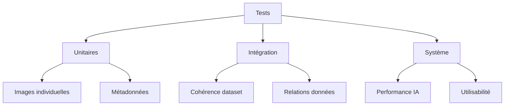

# Mission 11 : Protocole de test

## Briefing
Votre dataset enrichi doit maintenant être testé de manière systématique. Vous devez créer un protocole de test complet pour valider sa qualité et son efficacité.

## Objectifs d'apprentissage
- Concevoir un protocole de test
- Définir des métriques d'évaluation
- Créer des scénarios de test
- Établir des critères de validation

## Stratégie de test

### 1. Niveaux de test



### 2. Matrices de test

#### Qualité technique

```markdown
| Critère          | Méthode              | Seuil acceptation |
|------------------|----------------------|-------------------|
| Résolution       | Analyse pixels       | ≥ 1920x1080      |
| Netteté         | Score Laplacien      | ≥ 85/100         |
| Exposition       | Histogramme          | ± 0.5 EV         |
| Balance couleurs | Analyse RGB          | Δ ≤ 5%           |
```

#### Cohérence données

```markdown
| Aspect           | Vérification         | Critère          |
|------------------|---------------------|------------------|
| Nommage         | Regex pattern       | 100% conformité  |
| Métadonnées     | Schéma JSON         | 0 erreur         |
| Structure       | Arborescence        | 100% conforme    |
| Relations       | Intégrité refs      | 0 orphelin       |
```

## Protocoles détaillés

### 1. Tests unitaires

```python
class ImageTester:
    def __init__(self):
        self.thresholds = {
            'resolution': (1920, 1080),
            'sharpness_score': 85,
            'exposure_delta': 0.5,
            'color_balance': 0.05
        }
    
    def test_image(self, image_path):
        """
        Tests unitaires sur une image
        """
        results = {
            'technical': self.test_technical_quality(image_path),
            'metadata': self.test_metadata(image_path),
            'format': self.test_format_compliance(image_path)
        }
        return results
    
    def test_technical_quality(self, image_path):
        """
        Analyse qualité technique
        """
        metrics = {
            'resolution': self.check_resolution(),
            'sharpness': self.analyze_sharpness(),
            'exposure': self.check_exposure(),
            'color': self.analyze_color_balance()
        }
        return metrics
```

### 2. Tests d'intégration

```python
class DatasetIntegrationTester:
    def __init__(self, dataset_path):
        self.dataset_path = dataset_path
        self.error_log = []
    
    def test_dataset_integrity(self):
        """
        Vérifie la cohérence globale
        """
        checks = {
            'structure': self.verify_structure(),
            'references': self.check_references(),
            'completeness': self.verify_completeness()
        }
        return checks
    
    def verify_structure(self):
        """
        Vérifie la structure du dataset
        """
        expected_structure = self.load_structure_template()
        current_structure = self.analyze_current_structure()
        return self.compare_structures(expected_structure, current_structure)
```

### 3. Tests système

```python
class SystemTester:
    def __init__(self):
        self.performance_metrics = {}
        self.usability_scores = {}
    
    def test_ai_performance(self):
        """
        Évalue performances IA
        """
        scores = {
            'accuracy': self.measure_accuracy(),
            'speed': self.measure_processing_time(),
            'reliability': self.test_reliability()
        }
        return scores
```

## Scénarios de test

### 1. Test qualité image

```markdown
# Scénario QI-001: Qualité image

## Objectif
Valider qualité technique des images

## Étapes
1. Charger image
2. Vérifier résolution
3. Analyser netteté
4. Contrôler exposition
5. Vérifier couleurs

## Critères succès
□ Résolution conforme
□ Score netteté ≥ 85
□ Exposition ± 0.5 EV
□ Balance couleurs ± 5%

## Données test
- Images référence
- Métriques attendues
```

### 2. Test cohérence

```markdown
# Scénario CO-001: Cohérence dataset

## Objectif
Valider cohérence globale

## Étapes
1. Vérifier structure
2. Contrôler nommage
3. Valider métadonnées
4. Tester relations

## Critères succès
□ Structure 100% conforme
□ Nommage standardisé
□ Métadonnées complètes
□ Relations valides

## Données test
- Structure référence
- Patterns nommage
- Schémas validation
```

## Outils de test

### 1. Suite de tests automatisés

```python
class TestSuite:
    def __init__(self):
        self.image_tester = ImageTester()
        self.integration_tester = DatasetIntegrationTester()
        self.system_tester = SystemTester()
    
    def run_all_tests(self):
        """
        Exécute tous les tests
        """
        results = {
            'unit': self.run_unit_tests(),
            'integration': self.run_integration_tests(),
            'system': self.run_system_tests()
        }
        return self.generate_report(results)
```

### 2. Rapports de test

```markdown
# Rapport de test

## Résumé
- Tests exécutés: []
- Réussis: []
- Échecs: []
- Couverture: []%

## Détails par niveau
### Tests unitaires
- Total: []
- Réussite: []%
- Issues: []

### Tests intégration
- Total: []
- Réussite: []%
- Issues: []

### Tests système
- Total: []
- Réussite: []%
- Issues: []

## Issues critiques
1. [Description]
   - Impact: []
   - Priorité: []
   - Solution: []
```

## Documentation

### 1. Plan de test

```markdown
# Plan de test dataset

## 1. Stratégie
- Approche
- Niveaux
- Priorités

## 2. Environnement
- Configuration
- Outils
- Données

## 3. Calendrier
- Planning
- Ressources
- Jalons

## 4. Critères
- Entrée
- Sortie
- Validation
```

### 2. Journal de test

```markdown
# Journal de test

## Session [X]
Date: [DATE]
Testeur: [ID]

### Tests effectués
1. [Test ID]
   - Résultat: []
   - Issues: []
   - Notes: []

### Observations
- [Liste]

### Actions
- [Liste]
```

## Ressources

### Documentation
- Guide tests
- Standards qualité
- Procédures validation

### Outils
- Scripts test
- Analyseurs image
- Validateurs données

## Prochaines étapes
Après avoir établi le protocole de test, vous passerez à la Mission 12 : Validation, où vous appliquerez ces tests pour valider définitivement votre dataset.
