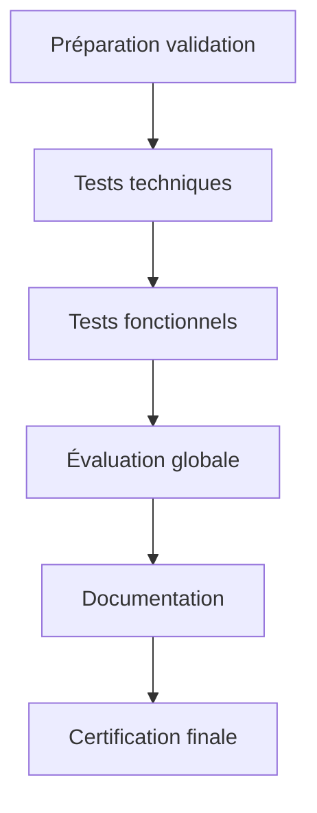

# Mission 12 : Validation finale

## Briefing
Votre dataset est maintenant prêt pour la validation finale. Cette étape cruciale déterminera si le dataset répond aux exigences du musée pour l'entraînement de leur système de reconnaissance des papillons.

## Objectifs d'apprentissage
- Exécuter le protocole de test complet
- Analyser les résultats en profondeur
- Valider la conformité du dataset
- Produire la documentation finale

## Processus de validation

### 1. Vue d'ensemble du processus



### 2. Checklist de validation

```markdown
# Validation complète

## Validation technique
□ Qualité images
  ├── Résolution
  ├── Netteté
  ├── Exposition
  └── Couleurs

## Validation structure
□ Organisation fichiers
  ├── Hiérarchie
  ├── Nommage
  └── Cohérence

## Validation données
□ Métadonnées
  ├── Complétude
  ├── Exactitude
  └── Conformité

## Validation fonctionnelle
□ Tests IA
  ├── Recognition
  ├── Performance
  └── Fiabilité
```

## Validation technique

### 1. Tests qualité image

```python
class ImageValidator:
    def __init__(self):
        self.quality_thresholds = {
            'resolution_min': (1920, 1080),
            'sharpness_score': 85,
            'exposure_tolerance': 0.5,
            'color_deviation_max': 5.0
        }
    
    def validate_image_set(self, image_folder):
        """
        Valide un ensemble d'images
        """
        results = {
            'passed': 0,
            'failed': 0,
            'issues': [],
            'metrics': {}
        }
        
        for image in self.get_images(image_folder):
            score = self.validate_single_image(image)
            self.update_results(results, score)
            
        return results
    
    def validate_single_image(self, image_path):
        """
        Valide une image individuelle
        """
        checks = {
            'resolution': self.check_resolution(),
            'sharpness': self.measure_sharpness(),
            'exposure': self.validate_exposure(),
            'color': self.check_color_balance()
        }
        return self.compute_final_score(checks)
```

### 2. Grille d'évaluation technique

| Critère          | Méthode         | Seuil | Résultat |
|------------------|-----------------|-------|-----------|
| Résolution       | Dimensions      | ≥1920×1080 | [ ] |
| Netteté         | Score Laplacien | ≥85/100    | [ ] |
| Exposition       | Histogramme     | ±0.5 EV    | [ ] |
| Couleurs        | Delta E         | ≤5.0       | [ ] |
| Format          | JPEG/Quality    | ≥90%       | [ ] |
| Taille fichier  | Bytes          | ≤5MB       | [ ] |

## Validation structurelle

### 1. Validation organisation

```python
def validate_dataset_structure(dataset_path):
    """
    Valide la structure complète du dataset
    """
    expected_structure = {
        'species': ['MBLU', 'APOL', 'MACH', 'PAPI', 'VULN'],
        'required_files': ['metadata.json', 'README.md'],
        'naming_pattern': r'^[A-Z]{4}_\d{8}_\d{3}_[A-Z]{3}\.(jpg|json)$'
    }
    
    validation_results = {
        'structure_valid': True,
        'issues': [],
        'statistics': {
            'total_files': 0,
            'valid_names': 0,
            'invalid_names': 0
        }
    }
    
    return validate_structure(dataset_path, expected_structure)
```

### 2. Matrice de validation structurelle

```markdown
# Validation structure

## Hiérarchie (/20)
□ Dossiers espèces (/5)
□ Sous-dossiers types (/5)
□ Organisation métadonnées (/5)
□ Structure documentation (/5)

## Nommage (/20)
□ Format standard (/5)
□ Cohérence codes (/5)
□ Séquences valides (/5)
□ Extensions correctes (/5)

## Relations (/20)
□ Images-métadonnées (/10)
□ Références croisées (/10)
```

## Validation fonctionnelle

### 1. Tests de reconnaissance

```python
class RecognitionValidator:
    def __init__(self, model_path):
        self.model = load_model(model_path)
        self.test_cases = self.prepare_test_cases()
    
    def validate_recognition(self):
        """
        Valide les capacités de reconnaissance
        """
        metrics = {
            'accuracy': [],
            'precision': [],
            'recall': [],
            'f1_score': []
        }
        
        for test_case in self.test_cases:
            result = self.run_recognition_test(test_case)
            self.update_metrics(metrics, result)
            
        return self.compute_final_metrics(metrics)
```

### 2. Critères de performance

```markdown
# Critères validation IA

## Reconnaissance (/40)
□ Précision globale ≥ 95%
□ Rappel global ≥ 90%
□ F1-Score ≥ 0.92
□ Temps réponse ≤ 500ms

## Robustesse (/30)
□ Variations lumière ≥ 85%
□ Variations angle ≥ 85%
□ Variations échelle ≥ 85%

## Fiabilité (/30)
□ Faux positifs ≤ 5%
□ Faux négatifs ≤ 5%
□ Constance résultats ≥ 90%
```

## Documentation finale

### 1. Rapport de validation

```markdown
# Rapport de validation finale

## 1. Résumé exécutif
- État global
- Points forts
- Points attention
- Recommandations

## 2. Validation technique
- Résultats tests
- Métriques qualité
- Issues identifiées
- Solutions appliquées

## 3. Validation structurelle
- Conformité organisation
- Cohérence données
- Points amélioration
- Actions correctives

## 4. Validation fonctionnelle
- Performance IA
- Fiabilité système
- Limitations identifiées
- Recommandations usage

## 5. Certification
- Décision finale
- Conditions utilisation
- Restrictions éventuelles
- Signatures validation
```

### 2. Documentation utilisateur

```markdown
# Guide utilisation dataset

## 1. Présentation
- Contenu
- Organisation
- Caractéristiques

## 2. Utilisation
- Accès données
- Manipulation images
- Gestion métadonnées

## 3. Limitations
- Contraintes techniques
- Restrictions usage
- Points attention

## 4. Support
- Documentation
- Ressources
- Contacts
```

## Certification finale

### 1. Checklist certification

```markdown
# Certification dataset

## Validation technique
□ Tests qualité passés
□ Métriques conformes
□ Documentation complète

## Validation structurelle
□ Organisation validée
□ Cohérence vérifiée
□ Standards respectés

## Validation fonctionnelle
□ Tests IA réussis
□ Performance validée
□ Fiabilité confirmée

## Documentation
□ Rapports générés
□ Guides complétés
□ Support préparé
```

### 2. Document certification

```markdown
# Certificat validation dataset

Le dataset [NOM] version [X.X] est certifié conforme
aux exigences du projet de reconnaissance des papillons
du Musée National d'Histoire Naturelle.

## Caractéristiques validées
- Images: [nombre] conformes
- Espèces: [nombre] documentées
- Qualité: [score]/100
- Performance: [score]/100

## Conditions utilisation
[Liste conditions]

## Restrictions
[Liste restrictions]

## Signatures
- Validateur technique: [NOM]
- Responsable qualité: [NOM]
- Directeur projet: [NOM]

Date: [DATE]
```

## Ressources

### Documentation
- Guides validation
- Standards certification
- Templates rapports

### Outils
- Scripts validation
- Outils analyse
- Générateurs rapports

## Conclusion du projet
Une fois la validation complétée et le dataset certifié, vous aurez accompli votre mission de création d'un dataset de qualité pour le système de reconnaissance des papillons du musée.
