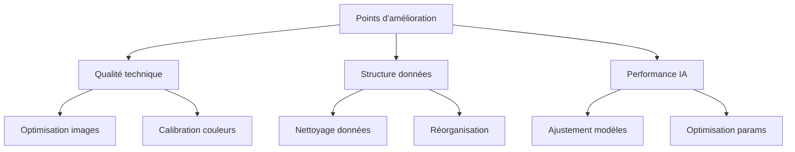

# Mission 13 : Amélioration finale

## Briefing
Suite à la validation complète, des ajustements finaux sont nécessaires pour optimiser le dataset avant sa livraison au musée. Cette mission vise à corriger les derniers problèmes et à maximiser la qualité globale.

## Objectifs d'apprentissage
- Optimiser les points faibles identifiés
- Affiner les paramètres critiques
- Maximiser les performances
- Finaliser la qualité globale

## Plan d'optimisation

### 1. Matrice d'amélioration



### 2. Processus d'optimisation

```python
class DatasetOptimizer:
    def __init__(self, dataset_path):
        self.dataset_path = dataset_path
        self.optimization_stats = {}
        
    def optimize_dataset(self):
        """
        Optimisation complète du dataset
        """
        steps = {
            'images': self.optimize_images(),
            'metadata': self.clean_metadata(),
            'structure': self.optimize_structure(),
            'performance': self.enhance_performance()
        }
        return self.generate_optimization_report(steps)
    
    def optimize_images(self):
        """
        Optimisation des images
        """
        optimizations = {
            'compression': self.optimize_compression(),
            'color_balance': self.calibrate_colors(),
            'sharpness': self.enhance_sharpness()
        }
        return optimizations
```

## Processus d'amélioration

### 1. Optimisation technique

# Optimisation technique

## Images
□ Compression optimale
  ├── Taille réduite
  ├── Qualité préservée
  └── Format optimal

## Couleurs
□ Calibration finale
  ├── Balance des blancs
  ├── Gamme dynamique
  └── Profil couleur

## Netteté
□ Amélioration finale
  ├── Détails préservés
  ├── Bruit minimisé
  └── Contours optimisés

### 2. Nettoyage données

```python
def clean_dataset():
    """
    Nettoyage final du dataset
    """
    cleaning_steps = {
        'remove_duplicates': remove_duplicate_images(),
        'fix_metadata': correct_metadata_issues(),
        'standardize_names': standardize_filenames(),
        'validate_structure': verify_dataset_structure()
    }
    return cleaning_steps

def remove_duplicate_images():
    """
    Détection et suppression des doublons
    """
    duplicates = find_duplicates()
    return remove_files(duplicates)
```

### 3. Optimisation performance

```python
class PerformanceOptimizer:
    def __init__(self):
        self.metrics = {
            'recognition_rate': 0,
            'processing_speed': 0,
            'memory_usage': 0
        }
    
    def optimize_performance(self):
        """
        Optimisation des performances
        """
        steps = {
            'cache': self.optimize_caching(),
            'indexing': self.improve_indexing(),
            'compression': self.optimize_storage()
        }
        return steps
```

## Outils d'optimisation

### 1. Scripts d'optimisation

```python
class OptimizationTools:
    def __init__(self):
        self.image_tools = ImageOptimizer()
        self.data_tools = DataCleaner()
        self.perf_tools = PerformanceEnhancer()
    
    def run_optimization_suite(self):
        """
        Exécute toute la suite d'optimisation
        """
        results = {
            'image_optimization': self.image_tools.optimize(),
            'data_cleaning': self.data_tools.clean(),
            'performance_enhancement': self.perf_tools.enhance()
        }
        return self.generate_report(results)
```

### 2. Métriques d'amélioration

## Qualité technique

| Métrique | Avant | Après | Gain |
|----------|-------|-------|------|
| Taille   | [ ]   | [ ]   | [ ]  |
| Netteté  | [ ]   | [ ]   | [ ]  |
| Couleur  | [ ]   | [ ]   | [ ]  |

## Performance

| Aspect    | Avant | Après | Gain |
|-----------|-------|-------|------|
| Vitesse   | [ ]   | [ ]   | [ ]  |
| Mémoire   | [ ]   | [ ]   | [ ]  |
| Précision | [ ]   | [ ]   | [ ]  |


## Validation des améliorations

### 1. Tests comparatifs

#### Qualité images
- Résolution: [▲/▼]
- Compression: [▲/▼]
- Netteté: [▲/▼]

#### Performance
- Temps traitement: [▲/▼]
- Utilisation mémoire: [▲/▼]
- Taux reconnaissance: [▲/▼]

#### Structure
- Organisation: [▲/▼]
- Cohérence: [▲/▼]
- Accessibilité: [▲/▼]


### 2. Rapport d'amélioration


#### Résumé des améliorations
- Total optimisations: []
- Gains performance: []%
- Réduction taille: []%

#### Détails techniques
1. Optimisation images
   - Méthodes utilisées
   - Résultats obtenus
   - Gains mesurés

2. Nettoyage données
   - Actions effectuées
   - Issues résolues
   - Améliorations structure

3. Performance
   - Optimisations réalisées
   - Gains mesurés
   - Impact utilisateur

### Documentation

#### 1. Journal d'optimisation

##### Session [X]
Date: [DATE]
Opérateur: [ID]

##### Optimisations effectuées
1. [Action]
   - Avant: [mesure]
   - Après: [mesure]
   - Gain: [%]

##### Issues résolues
- [Liste]

##### Notes
[Observations]

#### 2. Guide maintenance

##### Procédures régulières
1. Vérification intégrité
2. Optimisation routine
3. Nettoyage données

##### Interventions spécifiques
1. Correction erreurs
2. Mise à jour données
3. Optimisation performance

##### Outils maintenance
1. Scripts vérification
2. Outils optimisation
3. Utilitaires nettoyage
```

## Ressources

### Documentation
- Guides optimisation
- Procédures maintenance
- Rapports performance

### Outils
- Scripts optimisation
- Outils analyse
- Utilitaires maintenance

## Prochaines étapes
Après avoir finalisé les optimisations, vous passerez à la Mission 14 : Documentation, où vous créerez la documentation complète du projet.
