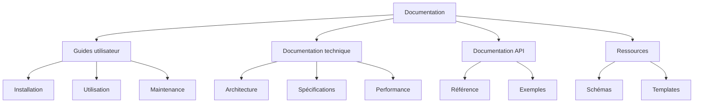

# Mission 14 : Documentation finale

## Briefing
La documentation complète est cruciale pour la transmission et l'utilisation future du dataset. Vous devez créer un ensemble complet de documents techniques et guides utilisateur.

## Objectifs d'apprentissage
- Créer une documentation exhaustive
- Structurer l'information efficacement
- Rédiger des guides clairs
- Assurer la maintenabilité

## Structure documentation

### 1. Organisation générale

```
documentation/
├── guides/
│   ├── installation.md
│   ├── utilisation.md
│   └── maintenance.md
├── technique/
│   ├── architecture.md
│   ├── specifications.md
│   └── performances.md
├── api/
│   ├── reference.md
│   └── exemples.md
└── ressources/
    ├── schemas/
    └── templates/
```

### 2. Types de documents



## Guide utilisateur

### 1. Structure du guide

#### 1. Introduction
- Présentation du dataset
- Objectifs et usage
- Prérequis système

#### 2. Installation
- Configuration requise
- Procédure d'installation
- Vérification installation

#### 3. Utilisation
- Interface principale
- Fonctionnalités de base
- Opérations avancées

#### 4. Maintenance
- Tâches régulières
- Résolution problèmes
- Mises à jour

#### 5. Support
- FAQ
- Contact support
- Ressources additionnelles

### 2. Exemples d'utilisation

```python
def dataset_usage_examples():
    """
    Exemples d'utilisation du dataset
    """
    # Exemple 1: Chargement basique
    dataset = load_dataset("path/to/dataset")
    
    # Exemple 2: Filtrage des données
    filtered_data = dataset.filter(species="Morpho")
    
    # Exemple 3: Analyse des images
    statistics = dataset.analyze_images()
    
    # Exemple 4: Export des résultats
    dataset.export_results("output/path")
```

## Documentation technique

### 1. Spécifications techniques

#### Architecture dataset
- Structure des données
- Format des fichiers
- Organisation dossiers
- Relations données

#### Caractéristiques techniques
- Formats images
- Schéma métadonnées
- Protocoles communication
- Standards utilisés

#### Performance
- Métriques référence
- Limites système
- Optimisations
- Recommandations


### 2. Documentation API

```python
class DatasetAPI:
    """
    API complète du dataset
    
    Attributes:
        version (str): Version de l'API
        base_path (str): Chemin base du dataset
    
    Methods:
        load_dataset: Charge le dataset
        filter_data: Filtre les données
        analyze: Analyse le dataset
        export: Exporte les résultats
    """
    
    def load_dataset(self, path):
        """
        Charge le dataset depuis le chemin spécifié
        
        Args:
            path (str): Chemin du dataset
            
        Returns:
            Dataset: Instance du dataset chargé
            
        Raises:
            DatasetError: Si erreur chargement
        """
        pass
```

## Guides maintenance

### 1. Procédures maintenance

#### Maintenance régulière
1. Vérification intégrité
   - Check données
   - Validation structure
   - Test cohérence

2. Optimisation
   - Nettoyage cache
   - Optimisation stockage
   - Mise à jour index

3. Sauvegarde
   - Backup données
   - Archive logs
   - Export configuration

### 2. Résolution problèmes

#### Problèmes courants
1. Erreur chargement
   - Cause possible
   - Solution proposée
   - Prévention

2. Problème performance
   - Diagnostic
   - Optimisation
   - Monitoring

3. Erreur données
   - Vérification
   - Correction
   - Validation

## Documentation qualité

### 1. Standards qualité

#### Images
- Résolution minimale
- Format accepté
- Qualité compression
- Balance couleurs

#### Métadonnées
- Schéma requis
- Validité données
- Complétude
- Cohérence

#### Performance
- Temps réponse
- Utilisation ressources
- Taux succès
- Fiabilité

### 2. Procédures validation

```python
class QualityValidator:
    def __init__(self):
        self.standards = load_quality_standards()
        
    def validate_quality(self, dataset):
        """
        Valide la qualité du dataset
        
        Returns:
            ValidationReport: Rapport de validation
        """
        validations = {
            'images': self.validate_images(),
            'metadata': self.validate_metadata(),
            'performance': self.validate_performance()
        }
        return self.generate_report(validations)
```

## Ressources supplémentaires

### 1. Templates

####Template guide
- Structure standard
- Sections requises
- Format contenu
- Style rédaction

#### Template rapport
- En-tête standard
- Corps document
- Conclusion
- Annexes

### 2. Scripts utilitaires

```python
class DocumentationTools:
    """
    Outils génération documentation
    """
    def generate_docs(self):
        """
        Génère la documentation complète
        """
        sections = {
            'user_guide': self.create_user_guide(),
            'technical_docs': self.create_technical_docs(),
            'api_docs': self.create_api_docs()
        }
        return self.compile_documentation(sections)
```

## Liste de contrôle finale

### 1. Vérification documentation

#### Documents requis
□ Guide utilisateur
□ Documentation technique
□ Documentation API
□ Guides maintenance

#### Qualité contenu
□ Clarté
□ Complétude
□ Cohérence
□ Actualité

#### Validation
□ Relecture technique
□ Test utilisateurs
□ Validation expert
□ Approbation finale

### 2. Validation finale

#### Critères
□ Documents complets
□ Standards respectés
□ Exemples validés
□ Tests effectués

#### Approbation
- Validateur: [NOM]
- Date: [DATE]
- Version: [X.X]

#### Conclusion
La documentation complète assure la pérennité et l'utilisabilité du dataset. Elle est le garant de sa transmission et de son utilisation efficace par les équipes du musée.
