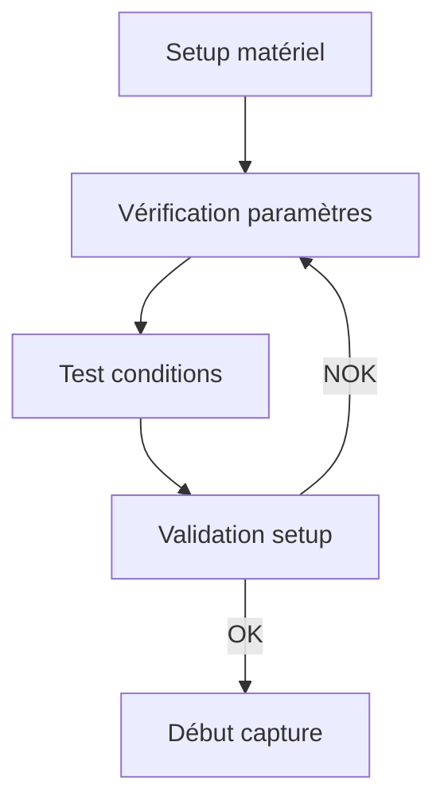
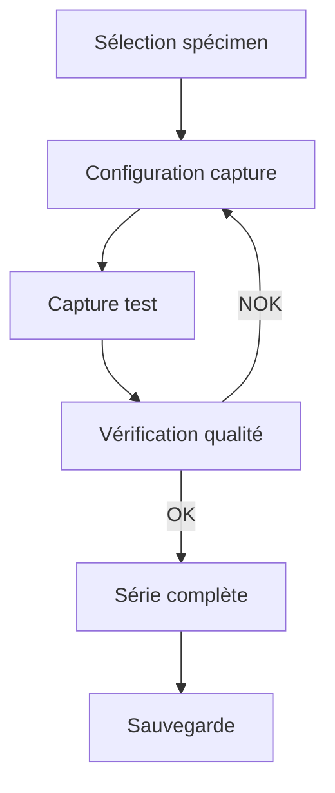
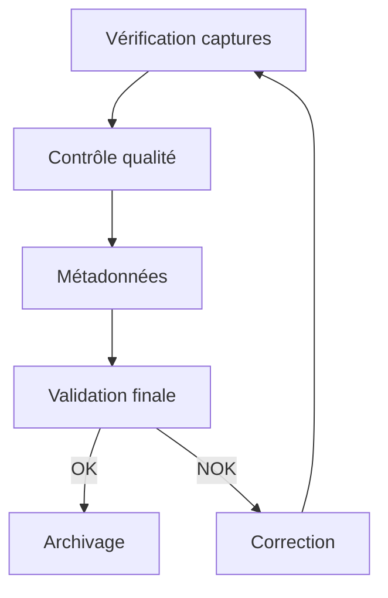
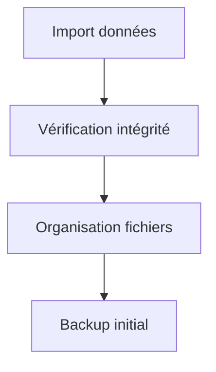
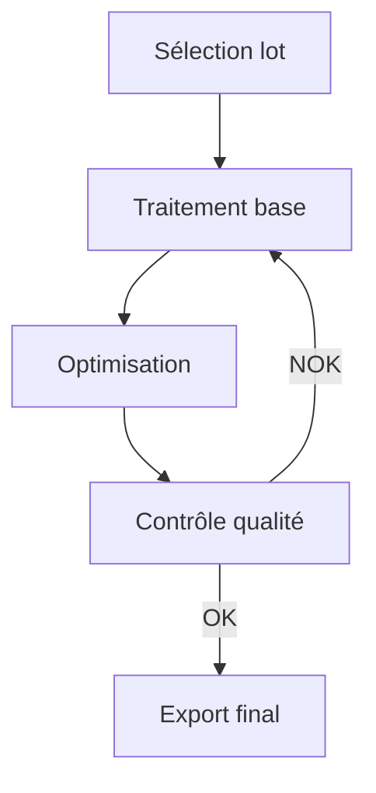
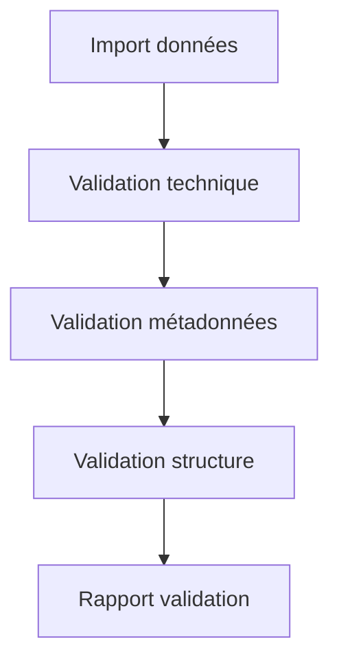

# Ressources Mission 5 : Organisation du travail

## 1. Système de gestion de projet

```python
class ProjectManager:
    def __init__(self):
        self.project_structure = {
            'setup': {
                'directory_structure': self.create_directory_structure,
                'naming_conventions': self.setup_naming_conventions,
                'metadata_templates': self.create_metadata_templates
            },
            'workflows': {
                'capture': self.setup_capture_workflow,
                'processing': self.setup_processing_workflow,
                'validation': self.setup_validation_workflow
            },
            'tracking': {
                'progress': self.track_progress,
                'quality': self.track_quality,
                'issues': self.track_issues
            }
        }

    def create_directory_structure(self):
        """
        Crée la structure de dossiers du projet
        """
        base_structure = {
            'raw': {
                'species': ['MBLU', 'APOL', 'MACH', 'PAPI', 'VULN'],
                'conditions': ['NAT', 'STU']
            },
            'processed': {
                'species': ['MBLU', 'APOL', 'MACH', 'PAPI', 'VULN'],
                'versions': ['v1', 'v2']
            },
            'metadata': {
                'templates': {},
                'species': {},
                'validation': {}
            },
            'documentation': {
                'protocols': {},
                'guides': {},
                'reports': {}
            }
        }
        return self.implement_structure(base_structure)

    def setup_naming_conventions(self):
        """
        Configure les conventions de nommage
        """
        return {
            'patterns': {
                'images': '{SPECIES}_{DATE}_{SEQ}_{COND}.jpg',
                'metadata': '{SPECIES}_{DATE}_{SEQ}_{COND}.json',
                'reports': 'REPORT_{TYPE}_{DATE}.md'
            },
            'codes': {
                'species': {
                    'MBLU': 'Morpho bleu',
                    'APOL': 'Apollon',
                    'MACH': 'Machaon',
                    'PAPI': 'Paon du jour',
                    'VULN': 'Vulcain'
                },
                'conditions': {
                    'NAT': 'Natural',
                    'STU': 'Studio',
                    'MAC': 'Macro',
                    'HDR': 'High Dynamic Range'
                }
            }
        }
```

## 2. Workflows détaillés

```markdown
# Workflows projet

## 1. Workflow capture

### Phase préparation


### Phase capture


### Phase validation


## 2. Workflow traitement

### Phase initiale


### Phase traitement


## 3. Workflow validation

### Phase contrôle

```

## 3. Templates de gestion

```python
class TemplateManager:
    def __init__(self):
        self.templates = {
            'metadata': self.create_metadata_template,
            'reports': self.create_report_templates,
            'documentation': self.create_doc_templates
        }

    def create_metadata_template(self):
        """
        Template métadonnées standard
        """
        return {
            "image_id": "",
            "capture": {
                "date": "",
                "time": "",
                "operator": "",
                "location": "",
                "conditions": {
                    "lighting": "",
                    "temperature": "",
                    "humidity": ""
                }
            },
            "subject": {
                "species": "",
                "specimen_id": "",
                "characteristics": {
                    "size": "",
                    "color": "",
                    "pattern": ""
                }
            },
            "technical": {
                "device": "HuskyLens",
                "settings": {
                    "resolution": "",
                    "exposure": "",
                    "focus_mode": "",
                    "white_balance": ""
                }
            },
            "processing": {
                "status": "raw",
                "history": [],
                "versions": []
            },
            "validation": {
                "quality_score": 0,
                "validator": "",
                "validation_date": "",
                "issues": []
            }
        }

    def create_report_templates(self):
        """
        Templates rapports projet
        """
        return {
            'daily': self.daily_report_template(),
            'weekly': self.weekly_report_template(),
            'quality': self.quality_report_template(),
            'technical': self.technical_report_template()
        }
```

## 4. Guides procédures

```markdown
# Guide des procédures

## 1. Procédures capture

### Installation matériel
1. Préparation zone
   - Surface dégagée
   - Éclairage contrôlé
   - Alimentation stable

2. Setup équipement
   - Montage support
   - Connexions vérifiées
   - Test système

3. Configuration
   - Paramètres base
   - Tests préliminaires
   - Validation setup

### Processus capture
1. Préparation
   - Vérification matériel
   - Test conditions
   - Checklist prêt

2. Capture
   - Protocole standard
   - Vérification directe
   - Sauvegarde immédiate

3. Validation
   - Contrôle qualité
   - Métadonnées
   - Documentation

## 2. Procédures traitement

### Import données
1. Vérification
   - Intégrité fichiers
   - Structure correcte
   - Backup réalisé

2. Organisation
   - Classement standard
   - Nommage vérifié
   - Métadonnées complètes

### Traitement images
1. Préparation
   - Sélection lot
   - Vérification état
   - Backup pré-traitement

2. Process
   - Étapes standards
   - Contrôle qualité
   - Documentation changes

## 3. Procédures validation

### Contrôle qualité
1. Technique
   - Standards respectés
   - Qualité conforme
   - Issues documentées

2. Organisation
   - Structure correcte
   - Nommage conforme
   - Relations valides

3. Documentation
   - Complétude
   - Exactitude
   - Mise à jour
```

## 5. Outils de suivi

```python
class ProjectTracker:
    def __init__(self):
        self.tracking_metrics = {
            'progress': {
                'total_images': 0,
                'completed': 0,
                'in_progress': 0,
                'pending': 0
            },
            'quality': {
                'passed': 0,
                'failed': 0,
                'needs_review': 0
            },
            'issues': {
                'open': [],
                'resolved': [],
                'in_progress': []
            }
        }

    def update_progress(self, status_update):
        """
        Met à jour le suivi de progression
        """
        self.tracking_metrics['progress'].update(status_update)
        self.generate_progress_report()

    def track_quality(self, quality_results):
        """
        Suivi qualité
        """
        for result in quality_results:
            category = self.categorize_result(result)
            self.tracking_metrics['quality'][category] += 1
        
        return self.generate_quality_report()

    def manage_issues(self, issue):
        """
        Gestion des problèmes
        """
        if issue['status'] == 'new':
            self.tracking_metrics['issues']['open'].append(issue)
        elif issue['status'] == 'resolved':
            self.move_to_resolved(issue)
        
        return self.generate_issues_report()

    def generate_dashboard(self):
        """
        Génère tableau de bord projet
        """
        return {
            'summary': self.create_summary(),
            'details': self.create_detailed_view(),
            'charts': self.create_visualization(),
            'recommendations': self.generate_recommendations()
        }
```

Ces ressources pour la Mission 5 fournissent :
1. Un système complet de gestion de projet
2. Des workflows détaillés et visuels
3. Des templates standardisés
4. Des guides de procédures complets
5. Des outils de suivi projet

Voulez-vous que je continue avec l'analyse et la création des ressources manquantes pour la Mission 6 ?