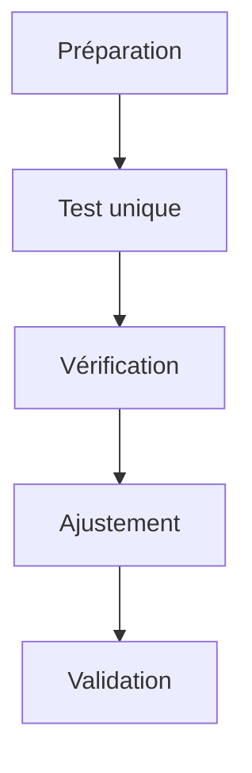
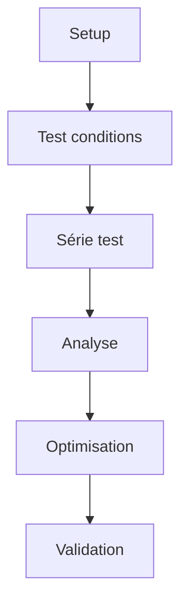
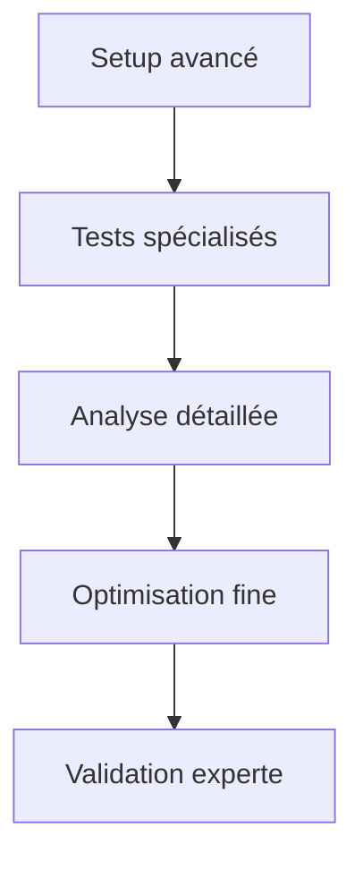

# Ressources Mission 7 : Capture test

## 1. Gestionnaire de tests

```python
class TestCaptureManager:
    def __init__(self):
        self.test_parameters = {
            'basic_test': {
                'images': 5,
                'angles': [0],
                'conditions': ['natural'],
                'validation_level': 'standard'
            },
            'comprehensive_test': {
                'images': 10,
                'angles': [0, 45, 90],
                'conditions': ['natural', 'studio'],
                'validation_level': 'detailed'
            },
            'advanced_test': {
                'images': 15,
                'angles': [0, 30, 45, 60, 90],
                'conditions': ['natural', 'studio', 'macro'],
                'validation_level': 'expert'
            }
        }

    def setup_test_session(self, test_type='basic_test'):
        """
        Configure une session de test
        """
        session = {
            'parameters': self.test_parameters[test_type],
            'setup': self.prepare_test_environment(),
            'workflow': self.create_test_workflow(),
            'validation': self.setup_validation_criteria()
        }
        
        return self.initialize_test_session(session)

    def prepare_test_environment(self):
        """
        Prépare l'environnement de test
        """
        environment = {
            'lighting': self.setup_test_lighting(),
            'equipment': self.configure_test_equipment(),
            'workspace': self.prepare_test_workspace()
        }
        
        return self.validate_environment(environment)

    def execute_test_sequence(self, test_config):
        """
        Exécute la séquence de test
        """
        results = []
        for i in range(test_config['images']):
            for angle in test_config['angles']:
                for condition in test_config['conditions']:
                    capture = self.perform_test_capture(angle, condition)
                    results.append(self.validate_capture(capture))
                    
        return self.analyze_test_results(results)
```

## 2. Protocoles de test

```markdown
# Protocoles de test capture

## 1. Test basique
### Objectif
Validation rapide du setup et de la qualité de base

### Configuration


### Étapes
1. Setup standard
   - Position neutre
   - Éclairage naturel
   - Distance 30cm

2. Capture test
   - Angle 0°
   - Mode auto
   - Vérification rapide

3. Validation
   - Qualité basique
   - Exposition correcte
   - Focus net

## 2. Test complet
### Objectif
Validation approfondie de toutes les configurations

### Configuration


### Étapes
1. Préparation
   - Multiple setups
   - Conditions variées
   - Équipement complet

2. Série captures
   - Angles multiples
   - Conditions diverses
   - Tests techniques

3. Analyse
   - Qualité détaillée
   - Comparaison conditions
   - Validation technique

## 3. Test avancé
### Objectif
Validation exhaustive pour optimisation

### Configuration


### Étapes
1. Configuration avancée
   - Setup complexe
   - Conditions contrôlées
   - Équipement spécialisé

2. Tests spéciaux
   - HDR
   - Macro
   - Focus stacking

3. Validation experte
   - Analyse approfondie
   - Optimisation précise
   - Documentation complète
```

## 3. Outils d'évaluation rapide

```python
class RapidEvaluator:
    def __init__(self):
        self.quick_metrics = {
            'technical': {
                'focus': self.check_quick_focus,
                'exposure': self.check_quick_exposure,
                'color': self.check_quick_color
            },
            'composition': {
                'framing': self.check_quick_framing,
                'alignment': self.check_quick_alignment
            },
            'metadata': {
                'basics': self.check_quick_metadata
            }
        }

    def quick_evaluate(self, image_path):
        """
        Évaluation rapide d'une capture
        """
        results = {}
        
        for category, checks in self.quick_metrics.items():
            results[category] = {}
            for name, check in checks.items():
                results[category][name] = check(image_path)
                
        return self.generate_quick_report(results)

    def generate_quick_report(self, results):
        """
        Génère rapport rapide
        """
        return {
            'summary': self.quick_summary(results),
            'pass_fail': self.determine_quick_status(results),
            'critical_issues': self.identify_quick_issues(results),
            'quick_fixes': self.suggest_quick_fixes(results)
        }
```

## 4. Fiches de validation test

```markdown
# Fiches validation test

## 1. Validation technique rapide
### Qualité image
| Critère    | Standard | Vérifié |
|------------|----------|----------|
| Focus      | Net      | □        |
| Exposition | ±0.5 EV  | □        |
| Couleurs   | Naturel  | □        |

### Composition
| Critère    | Standard | Vérifié |
|------------|----------|----------|
| Cadrage    | Centré   | □        |
| Alignement | Droit    | □        |
| Marges     | ≥10%     | □        |

### Données
| Critère    | Standard | Vérifié |
|------------|----------|----------|
| Format     | JPG      | □        |
| Taille     | >2MP     | □        |
| Metadata   | Basique  | □        |

## 2. Validation approfondie
### Technique
- [ ] Netteté optimale
  * Détails visibles
  * Pas de flou
  * Micro-contraste

- [ ] Exposition correcte
  * Histogramme équilibré
  * Pas de zones brûlées
  * Ombres détaillées

- [ ] Couleurs fidèles
  * Balance des blancs
  * Saturation naturelle
  * Teintes correctes

### Composition
- [ ] Cadrage précis
  * Sujet centré
  * Proportions respectées
  * Symétrie maintenue

- [ ] Géométrie
  * Horizontalité
  * Verticalité
  * Perspectives

### Métadonnées
- [ ] Informations techniques
  * Paramètres capture
  * Conditions
  * Équipement

- [ ] Documentation
  * Identification
  * Classification
  * Notes spécifiques
```

## 5. Journal de test

```python
class TestLogger:
    def __init__(self):
        self.log_structure = {
            'session_info': {
                'date': None,
                'operator': None,
                'conditions': None
            },
            'test_sequence': [],
            'results': [],
            'issues': [],
            'adjustments': []
        }

    def start_test_session(self, operator, conditions):
        """
        Démarre une session de test
        """
        session = self.log_structure.copy()
        session['session_info'].update({
            'date': datetime.now(),
            'operator': operator,
            'conditions': conditions
        })
        return session

    def log_test_capture(self, session, capture_data):
        """
        Enregistre une capture test
        """
        test_entry = {
            'timestamp': datetime.now(),
            'capture_id': capture_data['id'],
            'settings': capture_data['settings'],
            'results': capture_data['results'],
            'notes': capture_data['notes']
        }
        
        session['test_sequence'].append(test_entry)
        return self.update_session_status(session)

    def generate_test_report(self, session):
        """
        Génère rapport de session test
        """
        return {
            'session_summary': self.create_session_summary(session),
            'test_results': self.compile_test_results(session),
            'issues_summary': self.summarize_issues(session),
            'recommendations': self.create_recommendations(session)
        }
```

Ces ressources pour la Mission 7 fournissent :
1. Un système complet de gestion des tests
2. Des protocoles détaillés pour différents niveaux de test
3. Des outils d'évaluation rapide
4. Des fiches de validation standardisées
5. Un système de journalisation des tests

Voulez-vous que je continue avec l'analyse et la création des ressources manquantes pour la Mission 8 ?