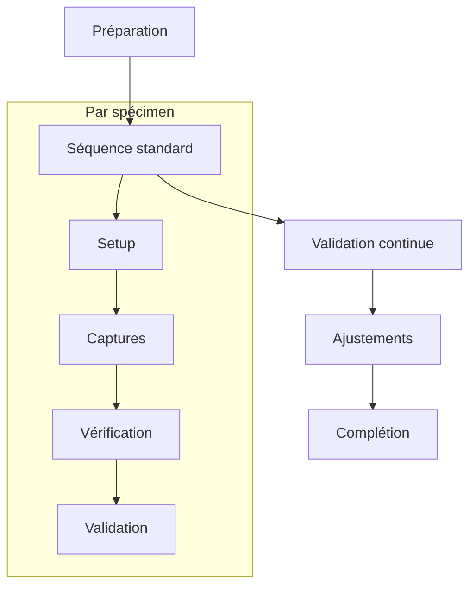

# Ressources Mission 8 : Première série

## 1. Gestionnaire de série

```python
class SeriesManager:
    def __init__(self):
        self.series_config = {
            'target': {
                'total_specimens': 5,
                'images_per_specimen': 10,
                'required_angles': [0, 45, 90],
                'required_conditions': ['NAT', 'STU']
            },
            'quality_thresholds': {
                'technical': 85,
                'composition': 80,
                'metadata': 90
            },
            'tracking': {
                'progress': True,
                'quality': True,
                'issues': True
            }
        }

    def initialize_series(self):
        """
        Initialise une nouvelle série
        """
        series = {
            'id': self.generate_series_id(),
            'start_time': datetime.now(),
            'config': self.series_config.copy(),
            'progress': self.initialize_progress_tracking(),
            'quality': self.initialize_quality_tracking(),
            'specimens': {}
        }
        return series

    def generate_capture_plan(self, series):
        """
        Génère plan de capture pour la série
        """
        plan = []
        for specimen in range(self.series_config['target']['total_specimens']):
            specimen_plan = self.create_specimen_plan(specimen)
            plan.extend(specimen_plan)
        
        return self.optimize_capture_sequence(plan)

    def track_series_progress(self, series):
        """
        Suit la progression de la série
        """
        return {
            'completion': self.calculate_completion(series),
            'quality_metrics': self.calculate_quality_metrics(series),
            'issues': self.track_issues(series),
            'estimated_completion': self.estimate_completion_time(series)
        }
```

## 2. Protocole de série

```markdown
# Protocole série complète

## 1. Planification série

### Organisation globale


### Planning captures
| Phase | Durée | Captures | Validation |
|-------|--------|-----------|------------|
| Setup | 15min  | -         | Équipement |
| Base  | 30min  | 5         | Rapide     |
| Comp. | 30min  | 5         | Complète   |
| Valid.| 15min  | -         | Finale     |

## 2. Workflow par spécimen

### Séquence capture
1. Configuration initiale
   - Setup matériel
   - Vérification conditions
   - Test rapide

2. Captures standards
   - Vue frontale (0°)
   - Vue oblique (45°)
   - Vue latérale (90°)

3. Captures complémentaires
   - Détails spécifiques
   - Angles additionnels
   - Conditions variées

### Validation continue
- Vérification après chaque capture
- Ajustements si nécessaire
- Documentation immédiate

## 3. Contrôle qualité série

### Points de contrôle
1. Niveau capture
   - Qualité technique
   - Composition
   - Métadonnées

2. Niveau spécimen
   - Complétude
   - Cohérence
   - Documentation

3. Niveau série
   - Progression
   - Uniformité
   - Standards

### Actions correctives
- Identification rapide problèmes
- Ajustements immédiats
- Documentation changements
```

## 3. Système de suivi

```python
class SeriesTracker:
    def __init__(self):
        self.tracking_metrics = {
            'completion': {
                'total_required': 0,
                'completed': 0,
                'in_progress': 0,
                'remaining': 0
            },
            'quality': {
                'passed': 0,
                'failed': 0,
                'needs_review': 0,
                'average_score': 0
            },
            'time': {
                'started': None,
                'estimated_completion': None,
                'actual_time_per_capture': []
            }
        }

    def update_progress(self, capture_data):
        """
        Met à jour le suivi de progression
        """
        self.update_completion_metrics(capture_data)
        self.update_quality_metrics(capture_data)
        self.update_time_metrics(capture_data)
        
        return self.generate_progress_report()

    def generate_dashboard(self):
        """
        Génère tableau de bord série
        """
        return {
            'progress_summary': self.create_progress_summary(),
            'quality_overview': self.create_quality_overview(),
            'time_analysis': self.create_time_analysis(),
            'recommendations': self.generate_recommendations()
        }

    def generate_alerts(self):
        """
        Génère alertes basées sur métriques
        """
        alerts = []
        if self.check_quality_issues():
            alerts.extend(self.generate_quality_alerts())
        if self.check_time_issues():
            alerts.extend(self.generate_time_alerts())
        return alerts
```

## 4. Fiches de contrôle

```markdown
# Fiches contrôle série

## 1. Contrôle par spécimen
### Checklist capture
□ Setup complet
  ├── Équipement vérifié
  ├── Conditions contrôlées
  └── Tests préliminaires

□ Captures standard
  ├── Vue 0° réalisée
  ├── Vue 45° réalisée
  └── Vue 90° réalisée

□ Validations
  ├── Qualité technique
  ├── Composition
  └── Métadonnées

### Métriques qualité
| Aspect     | Score | Seuil | Status |
|------------|-------|--------|--------|
| Technique  | []    | 85     | []     |
| Compo.     | []    | 80     | []     |
| Metadata   | []    | 90     | []     |

## 2. Contrôle série
### Progression
□ Spécimens traités: []/5
□ Images réalisées: []/50
□ Temps écoulé: []h[]m

### Qualité globale
□ Score moyen: []/100
□ Uniformité: []/100
□ Cohérence: []/100

### Issues
□ Critiques: []
□ Majeures: []
□ Mineures: []
```

## 5. Rapport de série

```python
class SeriesReporter:
    def __init__(self):
        self.report_sections = {
            'summary': self.create_summary,
            'technical': self.create_technical_report,
            'quality': self.create_quality_report,
            'issues': self.create_issues_report
        }

    def generate_series_report(self, series_data):
        """
        Génère rapport complet de série
        """
        report = {}
        for section, generator in self.report_sections.items():
            report[section] = generator(series_data)
        
        return self.format_report(report)

    def create_summary(self, data):
        """
        Crée résumé série
        """
        return {
            'completion_status': self.calculate_completion(data),
            'quality_overview': self.summarize_quality(data),
            'time_metrics': self.analyze_time_metrics(data),
            'key_findings': self.extract_key_findings(data)
        }

    def generate_visualizations(self, data):
        """
        Génère visualisations pour rapport
        """
        return {
            'progress_chart': self.create_progress_chart(data),
            'quality_distribution': self.create_quality_distribution(data),
            'time_analysis': self.create_time_analysis_chart(data),
            'issues_pareto': self.create_issues_pareto(data)
        }
```

Ces ressources pour la Mission 8 fournissent :
1. Un système complet de gestion de série
2. Des protocoles détaillés
3. Un système de suivi en temps réel
4. Des fiches de contrôle standardisées
5. Un système de rapport complet

Voulez-vous que je continue avec l'analyse et la création des ressources manquantes pour la Mission 9 ?