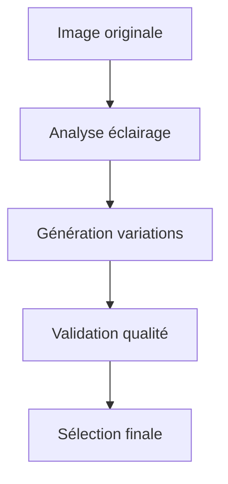
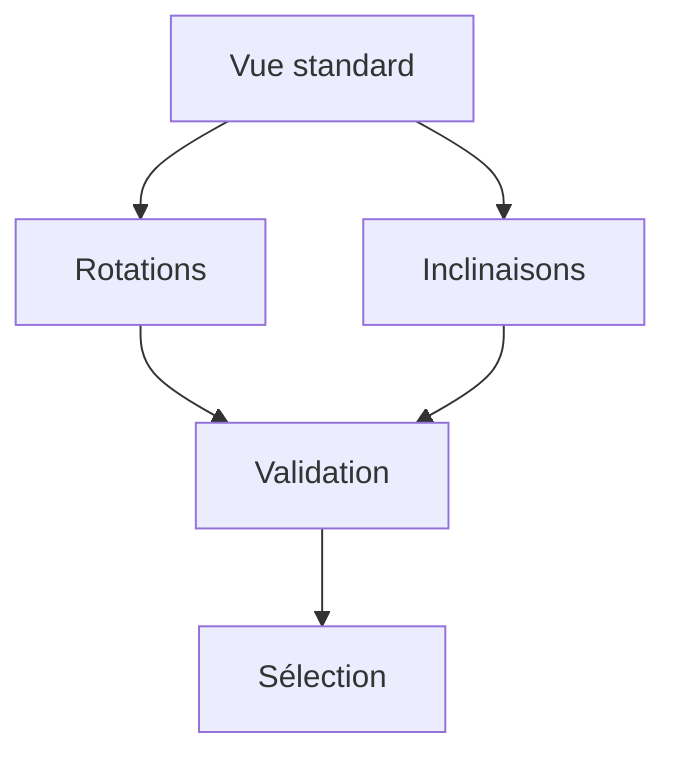

# Ressources Mission 10 : Enrichissement

## 1. Gestionnaire d'enrichissement

```python
class EnrichmentManager:
    def __init__(self):
        self.enrichment_strategies = {
            'data_augmentation': {
                'methods': {
                    'lighting': self.adjust_lighting,
                    'angle': self.modify_angle,
                    'exposure': self.adjust_exposure,
                    'detail': self.enhance_detail
                },
                'parameters': {
                    'intensity_range': (-0.3, 0.3),
                    'angle_range': (-15, 15),
                    'exposure_range': (-0.5, 0.5)
                }
            },
            'metadata_enhancement': {
                'methods': {
                    'technical': self.enhance_technical_metadata,
                    'taxonomic': self.enhance_taxonomic_data,
                    'environmental': self.enhance_environmental_data
                },
                'validation': {
                    'completeness': 0.95,
                    'accuracy': 0.98,
                    'consistency': 1.0
                }
            },
            'quality_improvement': {
                'methods': {
                    'sharpness': self.improve_sharpness,
                    'color': self.optimize_color,
                    'noise': self.reduce_noise
                },
                'thresholds': {
                    'sharpness_min': 85,
                    'color_accuracy': 90,
                    'noise_max': 0.1
                }
            }
        }

    def plan_enrichment(self, dataset_analysis):
        """
        Planifie l'enrichissement basé sur l'analyse
        """
        enrichment_plan = {
            'priority_actions': self.identify_priorities(dataset_analysis),
            'methods_selected': self.select_methods(dataset_analysis),
            'validation_criteria': self.define_validation_criteria(),
            'resource_requirements': self.estimate_resources()
        }
        return enrichment_plan

    def execute_enrichment(self, dataset_path, enrichment_plan):
        """
        Exécute le plan d'enrichissement
        """
        results = {
            'augmentation_results': self.perform_augmentation(),
            'metadata_results': self.enhance_metadata(),
            'quality_results': self.improve_quality()
        }
        return self.validate_enrichment(results)
```

## 2. Protocoles d'enrichissement

```markdown
# Protocoles d'enrichissement dataset

## 1. Augmentation données

### Variations d'éclairage


#### Paramètres
| Variation | Plage | Pas | Validation |
|-----------|-------|-----|------------|
| Intensité | ±30%  | 10% | Auto       |
| Direction | ±45°  | 15° | Visuelle   |
| Diffusion | 3 niv.| -   | Auto       |

### Variations angle


#### Paramètres
| Type      | Plage | Pas | Validation |
|-----------|-------|-----|------------|
| Rotation  | ±15°  | 5°  | Auto       |
| Inclinais.| ±10°  | 5°  | Visuelle   |

## 2. Enrichissement métadonnées

### Données techniques
1. Paramètres capture
   - Settings appareil
   - Conditions capture
   - Calibration

2. Données environnement
   - Conditions lumière
   - Température
   - Humidité

3. Données spécimen
   - Mesures précises
   - État conservation
   - Caractéristiques

### Documentation enrichie
1. Description détaillée
   - Morphologie
   - Patterns
   - Particularités

2. Classification
   - Taxonomie complète
   - Références
   - Validations

## 3. Amélioration qualité

### Optimisation technique
1. Netteté
   - Analyse zones floues
   - Enhancement local
   - Validation globale

2. Couleur
   - Calibration précise
   - Balance des blancs
   - Fidélité teintes

3. Bruit
   - Réduction intelligente
   - Préservation détails
   - Validation qualité
```

## 3. Outils d'enrichissement

```python
class EnrichmentTools:
    def __init__(self):
        self.tools = {
            'image_processing': {
                'enhancement': cv2.createCLAHE(clipLimit=2.0, tileGridSize=(8,8)),
                'sharpening': self.create_sharpening_kernel(),
                'noise_reduction': self.create_denoising_filter()
            },
            'metadata_tools': {
                'extractor': MetadataExtractor(),
                'validator': MetadataValidator(),
                'enricher': MetadataEnricher()
            },
            'quality_tools': {
                'analyzer': QualityAnalyzer(),
                'optimizer': QualityOptimizer(),
                'validator': QualityValidator()
            }
        }

    def enhance_image(self, image_path):
        """
        Améliore la qualité d'une image
        """
        image = self.load_image(image_path)
        enhanced = self.apply_enhancements(image)
        return self.validate_enhancement(enhanced)

    def enrich_metadata(self, metadata):
        """
        Enrichit les métadonnées
        """
        extracted = self.extract_additional_metadata(metadata)
        enriched = self.add_derived_information(extracted)
        return self.validate_metadata(enriched)

    def optimize_quality(self, dataset_item):
        """
        Optimise la qualité globale
        """
        quality_analysis = self.analyze_quality(dataset_item)
        optimized = self.apply_optimizations(dataset_item, quality_analysis)
        return self.validate_quality(optimized)
```

## 4. Validation enrichissement

```python
class EnrichmentValidator:
    def __init__(self):
        self.validation_criteria = {
            'augmentation': {
                'diversity': {
                    'minimum_variations': 3,
                    'coverage_threshold': 0.8,
                    'quality_threshold': 0.85
                },
                'quality': {
                    'technical_score': 85,
                    'visual_score': 80,
                    'consistency_score': 90
                }
            },
            'metadata': {
                'completeness': {
                    'required_fields': 0.95,
                    'optional_fields': 0.8,
                    'documentation': 0.9
                },
                'accuracy': {
                    'technical_data': 0.98,
                    'taxonomic_data': 1.0,
                    'environmental_data': 0.95
                }
            },
            'quality': {
                'technical': {
                    'sharpness_improvement': 0.15,
                    'color_accuracy': 0.9,
                    'noise_reduction': 0.2
                },
                'visual': {
                    'enhancement_visible': True,
                    'no_artifacts': True,
                    'natural_appearance': True
                }
            }
        }

    def validate_enrichment(self, enriched_data):
        """
        Valide l'enrichissement complet
        """
        validation_results = {
            'augmentation': self.validate_augmentation(enriched_data),
            'metadata': self.validate_metadata(enriched_data),
            'quality': self.validate_quality(enriched_data)
        }
        return self.generate_validation_report(validation_results)
```

## 5. Documentation enrichissement

```python
class EnrichmentDocumenter:
    def __init__(self):
        self.documentation_templates = {
            'process': {
                'methods': self.document_methods,
                'parameters': self.document_parameters,
                'results': self.document_results
            },
            'validation': {
                'criteria': self.document_criteria,
                'tests': self.document_tests,
                'outcomes': self.document_outcomes
            },
            'recommendations': {
                'improvements': self.document_improvements,
                'next_steps': self.document_next_steps,
                'maintenance': self.document_maintenance
            }
        }

    def generate_enrichment_documentation(self, enrichment_data):
        """
        Génère documentation complète
        """
        documentation = {
            'summary': self.create_summary(enrichment_data),
            'technical_details': self.document_technical_details(enrichment_data),
            'validation_results': self.document_validation(enrichment_data),
            'maintenance_guide': self.create_maintenance_guide(enrichment_data)
        }
        return self.format_documentation(documentation)

    def create_maintenance_guide(self, data):
        """
        Crée guide de maintenance
        """
        return {
            'routine_checks': self.define_routine_checks(),
            'quality_monitoring': self.define_monitoring_procedures(),
            'update_procedures': self.define_update_procedures(),
            'troubleshooting': self.create_troubleshooting_guide()
        }
```

Ces ressources pour la Mission 10 fournissent :
1. Un système complet de gestion de l'enrichissement
2. Des protocoles détaillés pour chaque type d'enrichissement
3. Des outils spécialisés pour l'amélioration
4. Un système de validation robuste
5. Une documentation exhaustive

Voulez-vous que je continue avec l'analyse et la création des ressources manquantes pour la Mission 11 ?