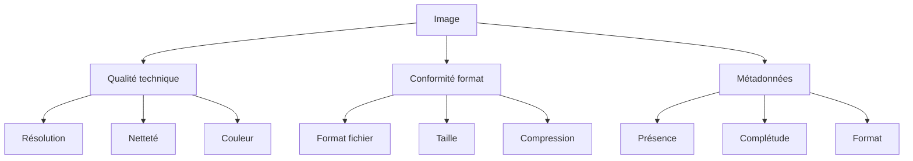
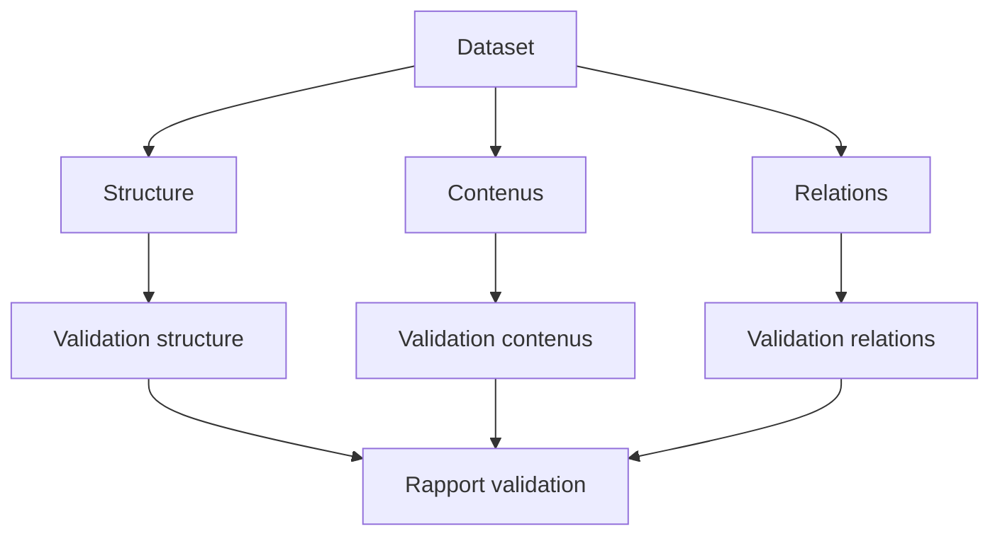

# Ressources Mission 11 : Protocole de test

## 1. Gestionnaire de tests

```python
class TestProtocolManager:
    def __init__(self):
        self.test_protocols = {
            'unit_tests': {
                'image_quality': self.test_image_quality,
                'metadata_validity': self.test_metadata,
                'file_integrity': self.test_file_integrity
            },
            'integration_tests': {
                'dataset_structure': self.test_dataset_structure,
                'cross_references': self.test_cross_references,
                'data_consistency': self.test_data_consistency
            },
            'system_tests': {
                'performance': self.test_performance,
                'reliability': self.test_reliability,
                'scalability': self.test_scalability
            },
            'acceptance_tests': {
                'completeness': self.test_completeness,
                'usability': self.test_usability,
                'documentation': self.test_documentation
            }
        }
        self.validation_metrics = {
            'quality_threshold': 0.85,
            'reliability_threshold': 0.95,
            'completeness_threshold': 0.98
        }

    def execute_test_suite(self, dataset_path):
        """
        Exécute suite de tests complète
        """
        test_results = {
            'unit': self.run_unit_tests(dataset_path),
            'integration': self.run_integration_tests(dataset_path),
            'system': self.run_system_tests(dataset_path),
            'acceptance': self.run_acceptance_tests(dataset_path)
        }
        
        return self.generate_test_report(test_results)

    def test_image_quality(self, image_path):
        """
        Tests qualité image
        """
        quality_tests = {
            'resolution': self.check_resolution(image_path),
            'sharpness': self.measure_sharpness(image_path),
            'color_accuracy': self.check_color_accuracy(image_path),
            'noise_level': self.measure_noise(image_path)
        }
        return self.evaluate_quality_results(quality_tests)
```

## 2. Protocoles de test détaillés

```markdown
# Protocoles de test standardisés

## 1. Tests unitaires

### Tests images


### Critères validation
| Test               | Critère            | Seuil    |
|-------------------|-------------------|----------|
| Résolution        | Min dimensions    | 1920x1080|
| Netteté           | Score Laplacien   | > 85     |
| Couleur           | Delta E           | < 5      |
| Taille fichier    | Compression       | < 2MB    |
| Métadonnées       | Complétude        | > 98%    |

## 2. Tests intégration

### Structure dataset
1. Organisation
   - Hiérarchie correcte
   - Nommage cohérent
   - Relations valides

2. Cohérence
   - Inter-fichiers
   - Cross-références
   - Métadonnées liées

### Validation globale


## 3. Tests système

### Performance
1. Temps chargement
   - Dataset complet
   - Accès aléatoire
   - Recherche

2. Utilisation ressources
   - Mémoire
   - CPU
   - Stockage

3. Scalabilité
   - Montée en charge
   - Limites système
   - Points rupture
```

## 3. Outils de test automatisés

```python
class AutomatedTestSuite:
    def __init__(self):
        self.test_tools = {
            'image_tests': ImageTestSuite(),
            'metadata_tests': MetadataTestSuite(),
            'structure_tests': StructureTestSuite(),
            'performance_tests': PerformanceTestSuite()
        }
        
    def run_automated_tests(self, dataset_path):
        """
        Exécute tests automatisés
        """
        test_results = {}
        for name, suite in self.test_tools.items():
            try:
                results = suite.run_tests(dataset_path)
                test_results[name] = {
                    'results': results,
                    'metrics': self.calculate_metrics(results),
                    'issues': self.identify_issues(results)
                }
            except TestError as e:
                self.handle_test_error(e, name)
                
        return self.generate_test_report(test_results)

class ImageTestSuite:
    def run_tests(self, image_path):
        """
        Tests automatisés images
        """
        return {
            'technical': self.run_technical_tests(image_path),
            'visual': self.run_visual_tests(image_path),
            'format': self.run_format_tests(image_path)
        }

class PerformanceTestSuite:
    def run_tests(self, dataset_path):
        """
        Tests performance
        """
        return {
            'load_time': self.measure_load_time(dataset_path),
            'memory_usage': self.measure_memory_usage(dataset_path),
            'processing_speed': self.measure_processing_speed(dataset_path)
        }
```

## 4. Métriques de validation

```python
class ValidationMetrics:
    def __init__(self):
        self.metrics = {
            'technical': {
                'image_quality': {
                    'resolution': {'min': 1920*1080, 'weight': 0.3},
                    'sharpness': {'min': 85, 'weight': 0.4},
                    'color': {'max_delta': 5, 'weight': 0.3}
                },
                'metadata_quality': {
                    'completeness': {'min': 0.98, 'weight': 0.4},
                    'accuracy': {'min': 0.95, 'weight': 0.3},
                    'consistency': {'min': 1.0, 'weight': 0.3}
                }
            },
            'performance': {
                'load_time': {'max': 2.0, 'weight': 0.3},  # seconds
                'memory_usage': {'max': 1024, 'weight': 0.3},  # MB
                'processing_speed': {'min': 50, 'weight': 0.4}  # images/sec
            },
            'usability': {
                'structure': {'min': 0.95, 'weight': 0.4},
                'documentation': {'min': 0.90, 'weight': 0.3},
                'accessibility': {'min': 0.90, 'weight': 0.3}
            }
        }

    def calculate_score(self, test_results):
        """
        Calcule score global validation
        """
        scores = {}
        for category, metrics in self.metrics.items():
            category_score = 0
            for metric_name, metric_config in metrics.items():
                score = self.calculate_metric_score(
                    test_results[category][metric_name],
                    metric_config
                )
                category_score += score * metric_config['weight']
            scores[category] = category_score
            
        return self.calculate_final_score(scores)
```

## 5. Rapports de test

```python
class TestReporter:
    def __init__(self):
        self.report_sections = {
            'summary': {
                'overview': self.create_overview,
                'key_metrics': self.summarize_metrics,
                'critical_issues': self.identify_critical_issues
            },
            'detailed_results': {
                'unit_tests': self.report_unit_tests,
                'integration_tests': self.report_integration_tests,
                'system_tests': self.report_system_tests
            },
            'analysis': {
                'trends': self.analyze_trends,
                'patterns': self.identify_patterns,
                'recommendations': self.generate_recommendations
            }
        }

    def generate_test_report(self, test_results):
        """
        Génère rapport de test complet
        """
        report = {}
        for section, generators in self.report_sections.items():
            report[section] = {}
            for name, generator in generators.items():
                report[section][name] = generator(test_results)
                
        return self.format_report(report)

    def generate_visualizations(self, test_results):
        """
        Génère visualisations résultats
        """
        return {
            'metrics_dashboard': self.create_metrics_dashboard(),
            'performance_graphs': self.create_performance_graphs(),
            'issue_analysis': self.create_issue_analysis()
        }
```

Ces ressources pour la Mission 11 fournissent :
1. Un système complet de gestion des tests
2. Des protocoles de test détaillés
3. Des outils de test automatisés
4. Des métriques de validation précises
5. Un système de reporting approfondi

Voulez-vous que je continue avec l'analyse et la création des ressources manquantes pour la Mission 12 ?