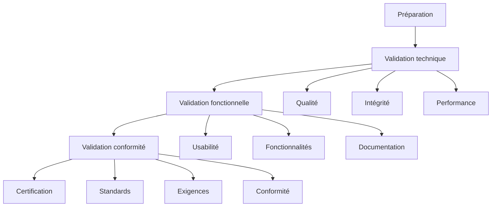

# Ressources Mission 12 : Validation finale

## 1. Système de validation finale

```python
class FinalValidator:
    def __init__(self):
        self.validation_modules = {
            'completeness': CompletenessValidator(),
            'quality': QualityValidator(),
            'compliance': ComplianceValidator(),
            'certification': CertificationManager()
        }
        
        self.certification_criteria = {
            'critical': {
                'completeness': 0.98,  # 98% minimum
                'quality_score': 0.90,  # 90% minimum
                'compliance': 1.0     # 100% requis
            },
            'major': {
                'documentation': 0.95,
                'metadata': 0.95,
                'structure': 0.95
            },
            'minor': {
                'optimization': 0.85,
                'accessibility': 0.90,
                'performance': 0.90
            }
        }

    def perform_final_validation(self, dataset_path):
        """
        Exécute validation finale complète
        """
        validation_results = {}
        validation_status = True
        
        for name, validator in self.validation_modules.items():
            try:
                results = validator.validate(dataset_path)
                validation_results[name] = results
                
                if not self.meets_criteria(results, name):
                    validation_status = False
            except ValidationError as e:
                self.handle_validation_error(e, name)
                validation_status = False
                
        return {
            'status': validation_status,
            'results': validation_results,
            'certification': self.generate_certification(validation_results)
        }

    def meets_criteria(self, results, category):
        """
        Vérifie si les résultats répondent aux critères
        """
        for level, criteria in self.certification_criteria.items():
            if category in criteria:
                if results['score'] < criteria[category]:
                    return False
        return True
```

## 2. Protocole de validation

```markdown
# Protocole de validation finale

## 1. Processus de validation


## 2. Critères de validation

### Validation technique
| Critère | Seuil | Poids | Méthode |
|---------|--------|-------|---------|
| Qualité images | 90% | 35% | Automatique |
| Métadonnées | 95% | 35% | Mixte |
| Structure | 95% | 30% | Automatique |

### Validation fonctionnelle
| Critère | Seuil | Poids | Méthode |
|---------|--------|-------|---------|
| Complétude | 98% | 40% | Automatique |
| Cohérence | 95% | 30% | Mixte |
| Utilisabilité | 90% | 30% | Manuel |

### Validation conformité
| Critère | Seuil | Poids | Méthode |
|---------|--------|-------|---------|
| Standards | 100% | 40% | Automatique |
| Documentation | 95% | 30% | Mixte |
| Sécurité | 100% | 30% | Automatique |

## 3. Processus de certification
### Étapes validation
1. Préparation
   - Vérification prérequis
   - Configuration validation
   - Préparation outils

2. Exécution
   - Tests automatiques
   - Validations manuelles
   - Documentation résultats

3. Certification
   - Analyse résultats
   - Décision certification
   - Génération certificat
```

## 3. Outils de validation

```python
class ValidationTools:
    def __init__(self):
        self.tools = {
            'technical': {
                'image_validator': ImageValidator(),
                'metadata_validator': MetadataValidator(),
                'structure_validator': StructureValidator()
            },
            'functional': {
                'completeness_checker': CompletenessChecker(),
                'consistency_checker': ConsistencyChecker(),
                'usability_tester': UsabilityTester()
            },
            'compliance': {
                'standards_checker': StandardsChecker(),
                'security_validator': SecurityValidator(),
                'documentation_checker': DocumentationChecker()
            }
        }

    def run_validation_checks(self, dataset_path):
        """
        Exécute tous les contrôles de validation
        """
        validation_results = {}
        
        for category, validators in self.tools.items():
            category_results = {}
            for name, validator in validators.items():
                try:
                    results = validator.validate(dataset_path)
                    category_results[name] = results
                except ValidationError as e:
                    self.handle_validation_error(e, name)
                    
            validation_results[category] = self.aggregate_results(category_results)
            
        return validation_results

    def aggregate_results(self, results):
        """
        Agrège les résultats de validation
        """
        return {
            'score': self.calculate_aggregate_score(results),
            'issues': self.collect_issues(results),
            'recommendations': self.generate_recommendations(results)
        }
```

## 4. Certificat de validation

```python
class CertificationManager:
    def __init__(self):
        self.certification_levels = {
            'gold': {
                'min_score': 0.95,
                'requirements': {
                    'critical': 1.0,
                    'major': 0.95,
                    'minor': 0.90
                }
            },
            'silver': {
                'min_score': 0.90,
                'requirements': {
                    'critical': 1.0,
                    'major': 0.90,
                    'minor': 0.85
                }
            },
            'bronze': {
                'min_score': 0.85,
                'requirements': {
                    'critical': 1.0,
                    'major': 0.85,
                    'minor': 0.80
                }
            }
        }

    def generate_certificate(self, validation_results):
        """
        Génère certificat de validation
        """
        certification_level = self.determine_certification_level(validation_results)
        
        return {
            'certificate_id': self.generate_certificate_id(),
            'dataset_info': self.get_dataset_info(),
            'validation_summary': self.summarize_validation(validation_results),
            'certification_level': certification_level,
            'validity_period': self.calculate_validity_period(),
            'conditions': self.generate_conditions(certification_level),
            'signatures': self.collect_signatures()
        }

    def determine_certification_level(self, results):
        """
        Détermine niveau de certification
        """
        for level, criteria in self.certification_levels.items():
            if self.meets_level_criteria(results, criteria):
                return level
        return None
```

## 5. Documentation finale

```python
class FinalDocumenter:
    def __init__(self):
        self.document_templates = {
            'validation_report': {
                'executive_summary': self.create_executive_summary,
                'technical_analysis': self.create_technical_analysis,
                'functional_analysis': self.create_functional_analysis,
                'compliance_analysis': self.create_compliance_analysis,
                'recommendations': self.create_recommendations
            },
            'certification_package': {
                'certificate': self.create_certificate,
                'validation_evidence': self.collect_evidence,
                'usage_guidelines': self.create_guidelines,
                'maintenance_plan': self.create_maintenance_plan
            }
        }

    def generate_final_documentation(self, validation_results):
        """
        Génère documentation finale complète
        """
        documentation = {}
        
        for doc_type, sections in self.document_templates.items():
            doc_content = {}
            for section_name, generator in sections.items():
                doc_content[section_name] = generator(validation_results)
            documentation[doc_type] = self.format_document(doc_content)
            
        return documentation

    def create_maintenance_plan(self, validation_results):
        """
        Crée plan de maintenance
        """
        return {
            'routine_checks': self.define_routine_checks(),
            'update_procedures': self.define_update_procedures(),
            'quality_monitoring': self.define_monitoring_procedures(),
            'issue_resolution': self.define_issue_procedures()
        }
```

Ces ressources pour la Mission 12 fournissent :
1. Un système complet de validation finale
2. Des protocoles de validation détaillés
3. Des outils de validation spécialisés
4. Un système de certification robuste
5. Une documentation finale exhaustive

Voulez-vous que je continue avec l'analyse et la création des ressources manquantes pour la Mission 13 ?