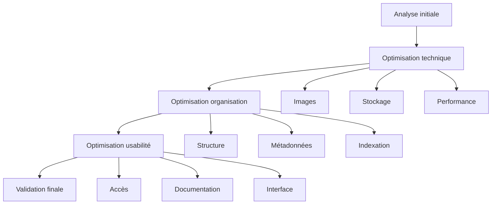

# Ressources Mission 13 : Amélioration finale

## 1. Système d'optimisation

```python
class FinalOptimizer:
    def __init__(self):
        self.optimization_modules = {
            'technical': {
                'image_quality': ImageQualityOptimizer(),
                'storage_efficiency': StorageOptimizer(),
                'performance': PerformanceOptimizer()
            },
            'organization': {
                'structure': StructureOptimizer(),
                'metadata': MetadataOptimizer(),
                'indexing': IndexingOptimizer()
            },
            'usability': {
                'access': AccessibilityOptimizer(),
                'documentation': DocumentationOptimizer(),
                'interface': InterfaceOptimizer()
            }
        }
        
        self.optimization_targets = {
            'quality': {
                'min_score': 0.95,
                'target_score': 0.98
            },
            'performance': {
                'load_time': 0.5,  # secondes
                'memory_usage': 512,  # MB
                'response_time': 0.1  # secondes
            },
            'efficiency': {
                'storage_reduction': 0.2,  # 20% minimum
                'access_speed': 0.3   # 30% amélioration
            }
        }

    def perform_final_optimization(self, dataset_path):
        """
        Exécute optimisation finale complète
        """
        optimization_results = {}
        improvement_metrics = {}
        
        for category, modules in self.optimization_modules.items():
            category_results = {}
            for name, optimizer in modules.items():
                try:
                    initial_metrics = self.measure_metrics(name)
                    results = optimizer.optimize(dataset_path)
                    final_metrics = self.measure_metrics(name)
                    
                    improvement = self.calculate_improvement(
                        initial_metrics,
                        final_metrics
                    )
                    
                    category_results[name] = {
                        'results': results,
                        'improvement': improvement,
                        'metrics': final_metrics
                    }
                    
                except OptimizationError as e:
                    self.handle_optimization_error(e, name)
                    
            optimization_results[category] = category_results
            improvement_metrics[category] = self.aggregate_improvements(
                category_results
            )
            
        return {
            'results': optimization_results,
            'improvements': improvement_metrics,
            'recommendations': self.generate_recommendations(improvement_metrics)
        }
```

## 2. Protocoles d'optimisation

```markdown
# Protocoles d'optimisation finale

## 1. Processus d'optimisation


## 2. Optimisation technique

### Images
1. Compression intelligente
   - Analyse qualité/taille
   - Optimisation format
   - Validation visuelle

2. Amélioration qualité
   - Netteté optimale
   - Balance couleurs
   - Réduction bruit

3. Performance
   - Temps chargement
   - Utilisation mémoire
   - Temps traitement

## 3. Optimisation organisation

### Structure
| Aspect | Méthode | Validation |
|--------|---------|------------|
| Hiérarchie | Réorganisation | Auto |
| Nommage | Standardisation | Auto |
| Relations | Optimisation | Mixte |

### Indexation
1. Index primaires
   - Espèces
   - Dates
   - Conditions

2. Index secondaires
   - Caractéristiques
   - Métadonnées
   - Relations

3. Performance
   - Temps recherche
   - Charge mémoire
   - Maintenance

## 4. Optimisation usabilité

### Accès
1. Interface
   - Navigation
   - Recherche
   - Filtres

2. Performance
   - Temps réponse
   - Charge serveur
   - Cache

3. Documentation
   - Guides
   - API
   - Exemples
```

## 3. Outils d'optimisation

```python
class OptimizationTools:
    def __init__(self):
        self.tools = {
            'image_optimization': {
                'compression': {
                    'method': 'intelligent_compression',
                    'params': {
                        'quality_threshold': 0.90,
                        'size_target': 0.7,  # 30% réduction
                        'format': 'optimized_jpeg'
                    }
                },
                'enhancement': {
                    'method': 'quality_enhancement',
                    'params': {
                        'sharpness_boost': 1.2,
                        'noise_reduction': 0.8,
                        'color_optimization': True
                    }
                }
            },
            'storage_optimization': {
                'compression': StorageCompressor(),
                'deduplication': Deduplicator(),
                'format_optimizer': FormatOptimizer()
            },
            'performance_optimization': {
                'caching': CacheOptimizer(),
                'indexing': IndexOptimizer(),
                'access_patterns': AccessOptimizer()
            }
        }

    def optimize_dataset(self, dataset_path):
        """
        Applique toutes les optimisations
        """
        optimizations = {}
        for category, tools in self.tools.items():
            category_results = self.apply_category_optimizations(
                dataset_path,
                tools
            )
            optimizations[category] = category_results
            
        return self.validate_optimizations(optimizations)

    def apply_category_optimizations(self, dataset_path, tools):
        """
        Applique optimisations par catégorie
        """
        results = {}
        for name, tool in tools.items():
            try:
                initial_state = self.measure_current_state(dataset_path, name)
                optimization_result = tool.optimize(dataset_path)
                final_state = self.measure_current_state(dataset_path, name)
                
                results[name] = {
                    'initial': initial_state,
                    'final': final_state,
                    'improvement': self.calculate_improvement(
                        initial_state,
                        final_state
                    ),
                    'details': optimization_result
                }
            except OptimizationError as e:
                self.handle_optimization_error(e, name)
                
        return results
```

## 4. Validation des optimisations

```python
class OptimizationValidator:
    def __init__(self):
        self.validation_criteria = {
            'quality': {
                'image_quality': {
                    'min_score': 0.95,
                    'improvement_threshold': 0.1
                },
                'metadata_quality': {
                    'completeness': 0.98,
                    'accuracy': 0.99
                }
            },
            'performance': {
                'response_time': {
                    'max': 0.5,  # secondes
                    'improvement_threshold': 0.3
                },
                'resource_usage': {
                    'max_memory': 512,  # MB
                    'max_cpu': 0.7      # 70% utilisation
                }
            },
            'efficiency': {
                'storage': {
                    'reduction_target': 0.2,
                    'format_efficiency': 0.8
                },
                'access': {
                    'speed_improvement': 0.3,
                    'pattern_efficiency': 0.85
                }
            }
        }

    def validate_optimizations(self, optimization_results):
        """
        Valide les résultats d'optimisation
        """
        validation_results = {}
        for category, criteria in self.validation_criteria.items():
            category_validation = self.validate_category(
                optimization_results[category],
                criteria
            )
            validation_results[category] = category_validation
            
        return self.generate_validation_report(validation_results)
```

## 5. Documentation des optimisations

```python
class OptimizationDocumenter:
    def __init__(self):
        self.documentation_templates = {
            'technical_report': {
                'summary': self.create_summary,
                'details': self.create_technical_details,
                'metrics': self.create_metrics_report
            },
            'improvement_report': {
                'before_after': self.create_comparison,
                'improvements': self.document_improvements,
                'validations': self.document_validations
            },
            'recommendations': {
                'further_improvements': self.suggest_improvements,
                'maintenance': self.create_maintenance_guide,
                'best_practices': self.document_best_practices
            }
        }

    def generate_optimization_documentation(self, optimization_data):
        """
        Génère documentation complète des optimisations
        """
        documentation = {}
        for doc_type, sections in self.documentation_templates.items():
            doc_content = {}
            for section_name, generator in sections.items():
                doc_content[section_name] = generator(optimization_data)
            documentation[doc_type] = self.format_document(doc_content)
            
        return documentation
```

Ces ressources pour la Mission 13 fournissent :
1. Un système complet d'optimisation finale
2. Des protocoles détaillés pour chaque type d'optimisation
3. Des outils d'optimisation spécialisés
4. Un système de validation des optimisations
5. Une documentation exhaustive des améliorations

Voulez-vous que je continue avec l'analyse et la création des ressources manquantes pour la Mission 14 ?