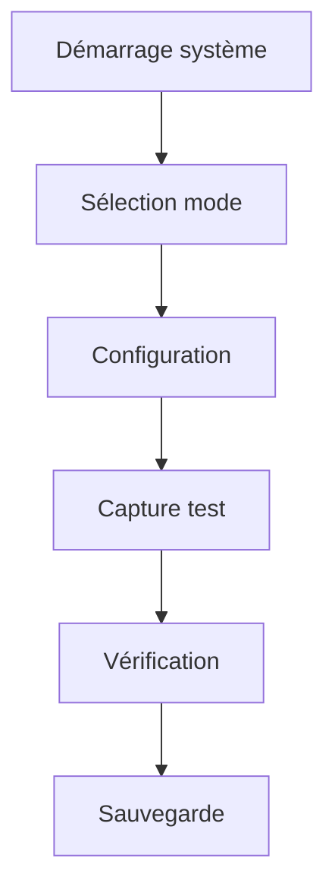

# Fiches Solutions - Missions 1 & 2

## Mission 1 : Premier contact avec le matériel

### Solution détaillée

#### 1. Installation physique
```markdown
# Étapes d'installation

1. Préparation du matériel
   □ Déballer soigneusement tous les composants
   □ Vérifier l'état de chaque élément
   □ Identifier les ports et connecteurs

2. Branchements
   □ Localiser le port Grove A sur le M5Stack
   □ Orienter correctement le câble Grove (détrompeur)
   □ Connecter en vérifiant l'emboîtement complet
   □ Installer la carte microSD si nécessaire

3. Vérification connexions
   □ Vérifier la solidité des branchements
   □ Contrôler l'alignement des connecteurs
   □ S'assurer qu'aucun fil n'est pincé
```

#### 2. Tests initiaux
```python
# Code de test basique
import M5Stack
from HUSKYLENS import *

def test_connection():
    # Initialisation
    M5Stack.begin()
    huskylens = HUSKYLENS()
    
    # Test connexion
    if huskylens.begin():
        print("HuskyLens connecté avec succès")
        return True
    else:
        print("Erreur de connexion")
        return False

def verify_system():
    checks = {
        'screen': test_screen(),
        'camera': test_camera(),
        'storage': test_storage()
    }
    return all(checks.values())
```

#### 3. Résolution problèmes courants
```markdown
# Guide dépannage rapide

## Problème : Écran noir
1. Vérifier l'alimentation
2. Maintenir le bouton power 5 secondes
3. Contrôler le niveau de batterie

## Problème : HuskyLens non détecté
1. Reconnecter le câble Grove
2. Vérifier l'orientation du câble
3. Tester avec un autre câble

## Problème : Carte SD non reconnue
1. Reformater en FAT32
2. Vérifier l'insertion
3. Tester une autre carte
```

### Points clés de réussite
1. Installation méthodique
2. Vérification systématique
3. Documentation des tests
4. Organisation du poste de travail

### Validation mission
```markdown
# Checklist validation M1

□ Installation matérielle complète
  ├── Connexions vérifiées
  ├── Alimentation testée
  └── Composants stables

□ Tests basiques réussis
  ├── Démarrage système
  ├── Détection HuskyLens
  └── Accès carte SD

□ Documentation complétée
  ├── Check-list remplie
  ├── Tests documentés
  └── Issues notées
```

## Mission 2 : Maîtrise des outils

### Solution détaillée

#### 1. Navigation interface
```markdown
# Guide navigation

## M5Stack
- Btn A : Navigation gauche
- Btn B : Sélection/Validation
- Btn C : Navigation droite

## HuskyLens
- Bouton fonction : Menu principal
- Bouton apprentissage : Capture/Learn
```

#### 2. Capture test
```python
def perform_test_capture():
    """
    Réalise une capture test complète
    """
    # Configuration
    huskylens.setMode(ALGORITHM_OBJECT_TRACKING)
    
    # Capture
    if huskylens.request():
        # Traitement image
        blocks = huskylens.getBlocks()
        
        # Sauvegarde
        save_to_sd(blocks)
        
        return True
    return False
```

#### 3. Workflow de base


### Points clés de réussite
1. Maîtrise navigation
2. Compréhension modes
3. Gestion fichiers efficace
4. Organisation workflow

### Validation mission
```markdown
# Checklist validation M2

□ Navigation maîtrisée
  ├── Menus accessibles
  ├── Fonctions comprises
  └── Workflow fluide

□ Captures réussies
  ├── Images nettes
  ├── Sauvegarde correcte
  └── Organisation claire

□ Documentation pratique
  ├── Notes d'utilisation
  ├── Astuces notées
  └── Problèmes documentés
```

### Ressources complémentaires

#### 1. Scripts utiles
```python
class ToolManager:
    def __init__(self):
        self.setup_tools()
        
    def setup_tools(self):
        """
        Configure les outils de base
        """
        self.init_camera()
        self.setup_storage()
        self.configure_display()
    
    def perform_basic_operations(self):
        """
        Opérations de base
        """
        self.capture_image()
        self.save_data()
        self.display_results()
```

#### 2. Templates documentation
```markdown
# Template rapport utilisation

## Session de travail
- Date : [DATE]
- Opérateur : [ID]
- Objectifs : [LISTE]

## Opérations effectuées
1. [OPERATION]
   - Résultat : [OK/NOK]
   - Notes : [OBSERVATIONS]

## Problèmes rencontrés
- [PROBLEME]
  * Cause : [DESCRIPTION]
  * Solution : [ACTION]
```

### Astuces et conseils
1. **Organisation**
   - Créer une structure de dossiers claire
   - Nommer les fichiers de manière cohérente
   - Maintenir un journal des opérations

2. **Efficacité**
   - Utiliser les raccourcis clavier
   - Automatiser les tâches répétitives
   - Créer des templates personnalisés

3. **Qualité**
   - Vérifier chaque capture
   - Documenter les paramètres
   - Maintenir une cohérence

### Support de débogage
```python
def debug_toolkit():
    """
    Outils de débogage basiques
    """
    tests = {
        'camera': test_camera_functions(),
        'storage': verify_storage_access(),
        'display': check_display_output()
    }
    
    return generate_debug_report(tests)
```
