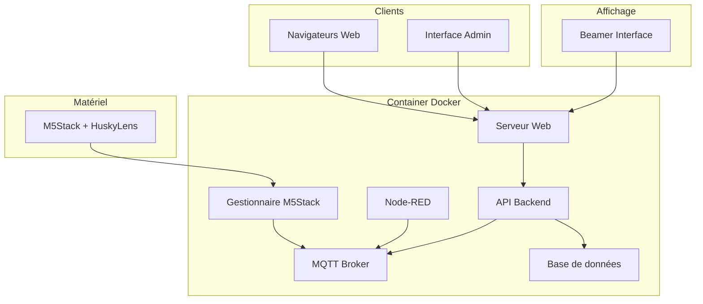
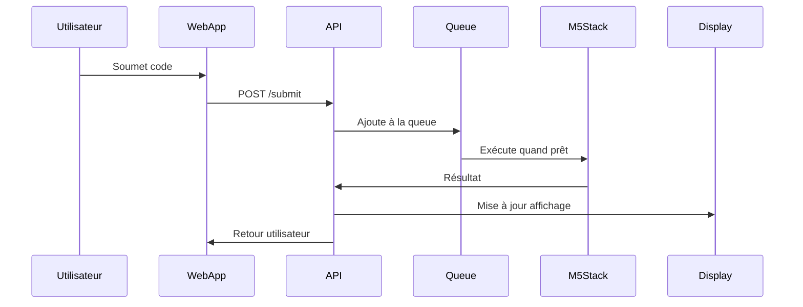
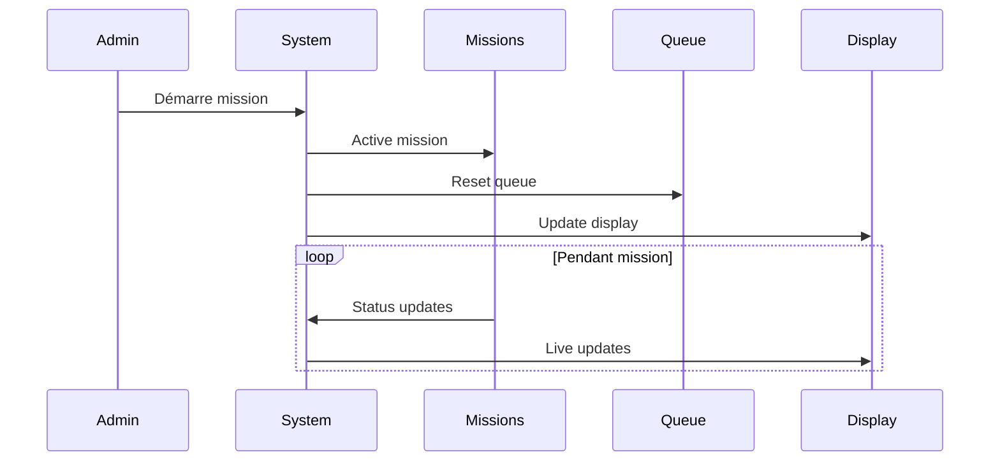

# Architecture Technique - M5Stack HuskyLens V2.0

## 0. Gestion du document

### 0.1 Historique des versions
| Version | Date       | Auteur | Modifications |
|---------|------------|---------|---------------|
| 1.0.0   | 2024-12-08| System  | Version initiale |

### 0.2 Validation
- [ ] Architecture générale
- [ ] Composants Docker
- [ ] Base de données
- [ ] MQTT
- [ ] Sécurité
- [ ] Monitoring
- [ ] Backup

## 1. Vue d'ensemble du système

### 1.1 Architecture globale


### 1.2 Composants principaux

#### A. Container Docker
Structure des conteneurs :
```yaml
services:
  webapp:
    build: ./webapp
    ports: 
      - "80:80"
    depends_on:
      - api
      - mqtt

  api:
    build: ./api
    ports:
      - "3000:3000"
    depends_on:
      - db
      - mqtt

  mqtt:
    image: eclipse-mosquitto
    ports:
      - "1883:1883"
      - "9001:9001"

  db:
    image: postgres
    volumes:
      - db_data:/var/lib/postgresql/data

  nodered:
    image: nodered/node-red
    ports:
      - "1880:1880"
    volumes:
      - nodered_data:/data

  m5stack-manager:
    build: ./m5stack-manager
    devices:
      - "/dev/ttyUSB0:/dev/ttyUSB0"
    depends_on:
      - mqtt
```

#### B. Base de données
Structure principale :
```sql
-- Utilisateurs
CREATE TABLE users (
    id SERIAL PRIMARY KEY,
    username VARCHAR(50) UNIQUE,
    password_hash VARCHAR(255),
    display_name VARCHAR(100),
    role VARCHAR(20),
    created_at TIMESTAMP DEFAULT CURRENT_TIMESTAMP
);

-- Missions
CREATE TABLE missions (
    id SERIAL PRIMARY KEY,
    title VARCHAR(100),
    description TEXT,
    order_num INTEGER,
    time_limit INTEGER,  -- en secondes
    active BOOLEAN DEFAULT true
);

-- Soumissions
CREATE TABLE submissions (
    id SERIAL PRIMARY KEY,
    user_id INTEGER REFERENCES users(id),
    mission_id INTEGER REFERENCES missions(id),
    code TEXT,
    status VARCHAR(20),
    points INTEGER,
    attempt_number INTEGER,
    submitted_at TIMESTAMP DEFAULT CURRENT_TIMESTAMP
);

-- Résultats
CREATE TABLE results (
    id SERIAL PRIMARY KEY,
    submission_id INTEGER REFERENCES submissions(id),
    success BOOLEAN,
    execution_time INTEGER,  -- en millisecondes
    error_message TEXT,
    created_at TIMESTAMP DEFAULT CURRENT_TIMESTAMP
);

-- Configuration
CREATE TABLE config (
    key VARCHAR(50) PRIMARY KEY,
    value TEXT,
    description TEXT,
    updated_at TIMESTAMP DEFAULT CURRENT_TIMESTAMP
);

-- Files d'attente
CREATE TABLE queue (
    id SERIAL PRIMARY KEY,
    submission_id INTEGER REFERENCES submissions(id),
    priority INTEGER,
    status VARCHAR(20),
    created_at TIMESTAMP DEFAULT CURRENT_TIMESTAMP
);
```

#### C. Architecture MQTT
Topics principaux :
```
m5stack/
├── control/
│   ├── start
│   ├── stop
│   └── reset
├── missions/
│   ├── {mission_id}/
│   │   ├── submit
│   │   ├── result
│   │   └── status
├── queue/
│   ├── next
│   ├── current
│   └── complete
├── system/
│   ├── status
│   └── heartbeat
└── display/
    ├── update
    └── refresh
```

#### D. Système de fichiers
Structure des données persistantes :
```
docker-home/M5stackHuskyLens/
├── config/
│   ├── mqtt/
│   │   ├── mosquitto.conf
│   │   └── auth/
│   ├── nginx/
│   │   └── nginx.conf
│   └── nodered/
│       └── flows.json
├── data/
│   ├── db/
│   ├── submissions/
│   ├── logs/
│   └── backups/
└── www/
    ├── admin/
    ├── student/
    └── display/
```

### 1.3 Flux de données

#### A. Soumission de code


#### B. Gestion des missions


### 1.4 Sécurité

#### A. Authentification
- JWT pour les sessions web
- Certificats SSL pour MQTT
- Authentification unique pour Node-RED

#### B. Autorisation
```javascript
const permissions = {
  student: {
    submit: true,
    view_own: true,
    view_public: true
  },
  teacher: {
    all: true,
    admin: true
  },
  system: {
    internal: true
  }
};
```

### 1.5 Monitoring et Alertes

#### A. Métriques système
```yaml
monitoring:
  system:
    # Métriques matérielles
    - cpu_usage
    - memory_usage
    - disk_usage
    - network_io
    
    # Métriques applicatives
    - active_users
    - queue_length
    - mission_status
    - response_times
    
    # Métriques M5Stack
    - connection_status
    - usb_stability
    - execution_times
```

#### B. Système d'alertes
```yaml
alerts:
  # Alertes système
  system:
    cpu_high:
      threshold: 80%
      duration: 5m
    memory_high:
      threshold: 90%
      duration: 5m
    disk_space_low:
      threshold: 90%
      
  # Alertes application
  application:
    queue_full:
      threshold: 90%
    response_time:
      threshold: 2s
    error_rate:
      threshold: 5%
      window: 5m
      
  # Alertes M5Stack
  m5stack:
    connection_lost:
      timeout: 30s
    execution_timeout:
      threshold: 10s
```

#### C. Logging
```yaml
logging:
  # Logs système
  system:
    path: /var/log/m5stack/system
    rotation: daily
    retention: 30d
    
  # Logs application
  application:
    path: /var/log/m5stack/app
    rotation: daily
    retention: 30d
    levels:
      - error
      - warn
      - info
      - debug
      
  # Logs M5Stack
  m5stack:
    path: /var/log/m5stack/device
    rotation: hourly
    retention: 7d
```

### 1.6 Stratégie de Backup

#### A. Données à sauvegarder
```yaml
backups:
  # Base de données
  database:
    type: postgres_dump
    frequency: hourly
    retention: 7d
    
  # Fichiers de configuration
  config:
    type: file_sync
    frequency: daily
    retention: 30d
    
  # Données utilisateur
  user_data:
    type: incremental
    frequency: hourly
    retention: 30d
    
  # Logs
  logs:
    type: archive
    frequency: daily
    retention: 90d
```

#### B. Procédures de restauration
```yaml
restore:
  # Procédure standard
  standard:
    1. Arrêt des services
    2. Restauration BDD
    3. Restauration fichiers
    4. Vérification intégrité
    5. Redémarrage services
    
  # Procédure d'urgence
  emergency:
    1. Basculement sur backup
    2. Restauration à chaud
    3. Synchronisation delta
```

#### C. Tests de restauration
```yaml
backup_tests:
  frequency: weekly
  types:
    - full_restore
    - partial_restore
    - integrity_check
  reporting:
    - success_rate
    - restore_time
    - data_integrity
```

#### C. Validation
- Validation syntaxique Quorum côté client
- Limites d'exécution
- Sanitization des entrées

Je continue avec plus de détails ou souhaitez-vous examiner cette première partie ?