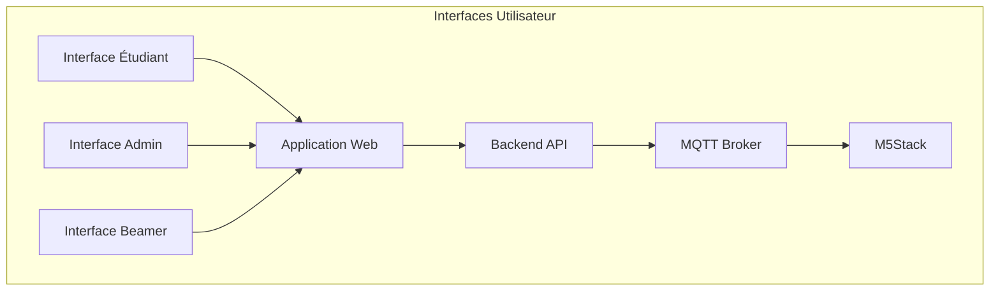
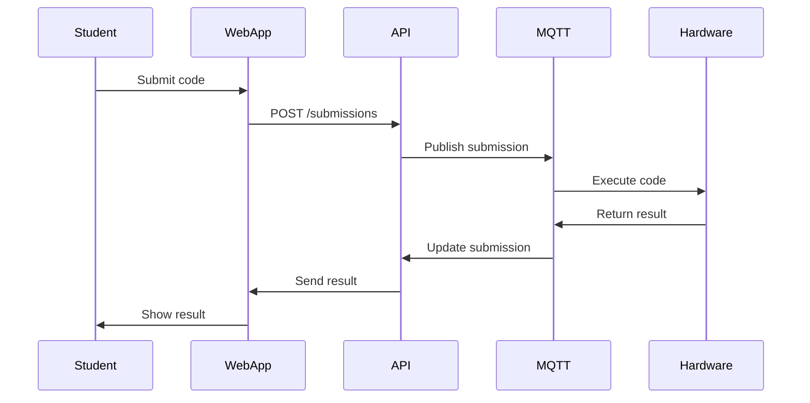
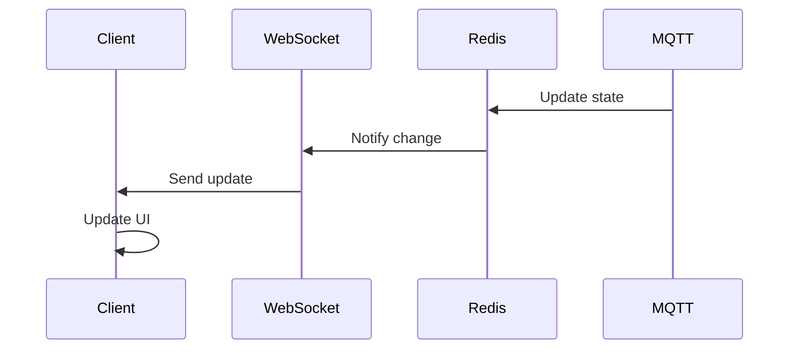

# Architecture des Interfaces Utilisateur - M5Stack HuskyLens V2.0

## 1. Vue d'ensemble

### 1.1 Types d'interfaces


### 1.2 Structure technique
```
frontend/
├── student/          # Interface étudiant
├── admin/           # Interface administrateur
├── display/         # Interface beamer
└── shared/          # Composants partagés

backend/
├── api/             # API REST
├── websocket/       # Serveur WebSocket
└── mqtt/           # Gestionnaire MQTT
```

## 2. Technologies utilisées

### 2.1 Frontend
- Vue.js 3 avec Composition API
- TypeScript
- TailwindCSS pour le style
- Monaco Editor pour l'éditeur de code
- Chart.js pour les graphiques
- Socket.io pour les WebSockets

### 2.2 Backend
- Node.js avec Express
- TypeScript
- MQTT.js pour MQTT
- PostgreSQL pour la base de données
- Redis pour le cache
- Socket.io pour les WebSockets

## 3. Composants partagés

### 3.1 Services communs
```typescript
// Authentication Service
interface AuthService {
    login(credentials: Credentials): Promise<User>;
    logout(): Promise<void>;
    refreshToken(): Promise<string>;
    getUser(): User | null;
}

// WebSocket Service
interface WebSocketService {
    connect(): void;
    subscribe(topic: string, callback: Function): void;
    unsubscribe(topic: string): void;
    emit(event: string, data: any): void;
}

// MQTT Service
interface MQTTService {
    connect(): Promise<void>;
    publish(topic: string, message: any): void;
    subscribe(topic: string, callback: Function): void;
}
```

### 3.2 Types communs
```typescript
interface Mission {
    id: number;
    title: string;
    description: string;
    requirements: MissionRequirements;
    timeLimit: number;
    points: number;
}

interface Submission {
    id: number;
    userId: number;
    missionId: number;
    code: string;
    status: 'pending' | 'running' | 'completed' | 'failed';
    result?: SubmissionResult;
}

interface User {
    id: number;
    username: string;
    role: 'student' | 'admin';
    currentMission?: number;
    points: number;
}
```

## 4. Flux de données

### 4.1 Flux de soumission


### 4.2 Flux de mise à jour en temps réel


## 5. Sécurité

### 5.1 Authentication
```typescript
// JWT Configuration
interface JWTConfig {
    secret: string;
    expiresIn: string;
    refreshExpiresIn: string;
}

// Auth Middleware
const authMiddleware = (roles: string[]) => {
    return (req: Request, res: Response, next: NextFunction) => {
        const token = req.headers.authorization;
        if (!token) return res.status(401).json({ error: 'No token provided' });
        
        try {
            const decoded = verifyToken(token);
            if (!roles.includes(decoded.role)) {
                return res.status(403).json({ error: 'Unauthorized' });
            }
            req.user = decoded;
            next();
        } catch (error) {
            res.status(401).json({ error: 'Invalid token' });
        }
    };
};
```

### 5.2 Validation des entrées
```typescript
// Input Validation Schema
const submissionSchema = Joi.object({
    missionId: Joi.number().required(),
    code: Joi.string().max(5000).required(),
    language: Joi.string().valid('quorum').required()
});

// Validation Middleware
const validateInput = (schema: Joi.Schema) => {
    return (req: Request, res: Response, next: NextFunction) => {
        const { error } = schema.validate(req.body);
        if (error) {
            return res.status(400).json({
                error: 'Invalid input',
                details: error.details
            });
        }
        next();
    };
};
```

## 6. Performance

### 6.1 Optimisations Frontend
```typescript
// Code Splitting
const StudentView = () => import('./views/StudentView.vue')
const AdminView = () => import('./views/AdminView.vue')
const DisplayView = () => import('./views/DisplayView.vue')

// State Management
const store = createStore({
    state: {
        missions: [],
        submissions: [],
        currentUser: null
    },
    getters: {
        filteredMissions: (state) => (filter) => {
            return state.missions.filter(filter)
        }
    }
})
```

### 6.2 Optimisations Backend
```typescript
// Caching
const cache = new NodeCache({
    stdTTL: 600,
    checkperiod: 120
});

// Rate Limiting
const rateLimiter = rateLimit({
    windowMs: 15 * 60 * 1000,
    max: 100
});

// Connection Pooling
const pool = new Pool({
    max: 20,
    idleTimeoutMillis: 30000,
    connectionTimeoutMillis: 2000
});
```

## 7. Monitoring

### 7.1 Métriques Frontend
```typescript
interface UIMetrics {
    pageLoads: number;
    interactions: number;
    errors: number;
    loadTime: number;
    responseTime: number;
}

const trackMetric = (metric: keyof UIMetrics, value: number) => {
    // Envoyer au service de monitoring
};
```

### 7.2 Métriques Backend
```typescript
interface APIMetrics {
    requests: number;
    errors: number;
    responseTime: number;
    activeConnections: number;
    mqttMessages: number;
}

const monitoringMiddleware = (req: Request, res: Response, next: NextFunction) => {
    const start = Date.now();
    res.on('finish', () => {
        const duration = Date.now() - start;
        metrics.track('responseTime', duration);
    });
    next();
};
```

## 8. Tests

### 8.1 Tests Frontend
```typescript
// Component Tests
describe('SubmissionForm', () => {
    it('validates input', async () => {
        const wrapper = mount(SubmissionForm);
        await wrapper.find('textarea').setValue('invalid code');
        await wrapper.find('form').trigger('submit');
        
        expect(wrapper.find('.error').exists()).toBe(true);
    });
});

// E2E Tests
describe('Mission Flow', () => {
    it('completes mission successfully', () => {
        cy.login('student1');
        cy.visit('/missions/1');
        cy.get('#code-editor').type('valid code');
        cy.get('#submit').click();
        cy.get('.success').should('be.visible');
    });
});
```

### 8.2 Tests Backend
```typescript
// API Tests
describe('Submissions API', () => {
    it('creates new submission', async () => {
        const response = await request(app)
            .post('/api/submissions')
            .send({
                missionId: 1,
                code: 'test code'
            });
        
        expect(response.status).toBe(201);
        expect(response.body).toHaveProperty('id');
    });
});

// Integration Tests
describe('MQTT Integration', () => {
    it('processes submission correctly', (done) => {
        const submission = {
            id: 1,
            code: 'test code'
        };
        
        mqtt.publish('submissions/new', submission);
        
        mqtt.subscribe('submissions/result', (msg) => {
            expect(msg).toHaveProperty('status', 'completed');
            done();
        });
    });
});
```